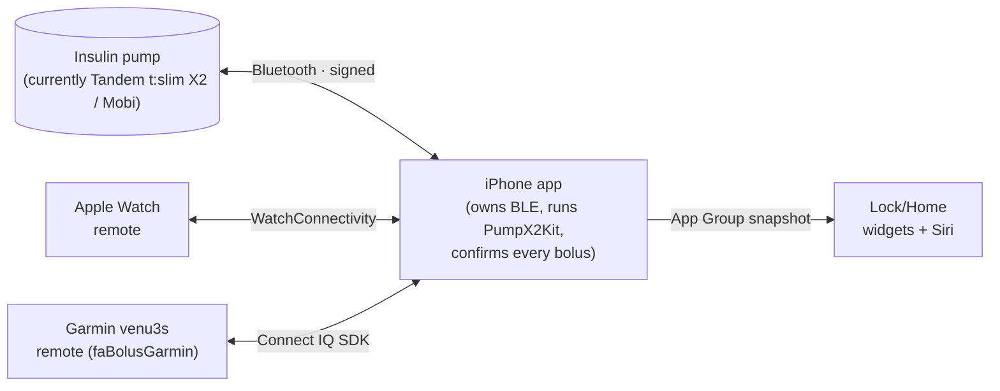

# How it works

A quick tour of the pieces and who's responsible for what. You don't need this to build or use
the app — it's here if you're curious or want to contribute.

## The big picture

**One rule organizes everything: only the iPhone talks to the pump.** The Apple Watch and Garmin
are *remotes* — they send requests to the iPhone, which owns the single Bluetooth connection,
runs the safety interlocks, and does the actual delivery.



## The repositories

```
PumpX2Kit  (Swift package — build once, reuse everywhere)
├── PumpX2Messages   framing, opcodes, request/response models, packetization, CRC/HMAC
├── PumpX2Auth       legacy pairing + EC-JPAKE (mbedTLS), per-command signing
└── PumpX2BLE        Core Bluetooth central (iOS + watchOS)

faBolus  (this repo, consumes PumpX2Kit via SPM)
├── ios/faBolus/         iOS host app — owns the pump connection; tabbed modern UI
├── ios/faBolusWidgets/  Lock/Home Screen widgets (incl. Quick Bolus)
├── watch/faBolusWatch/  Apple Watch remote (WatchConnectivity)
├── watch/faBolusWatchWidgets/  watch-face complication
├── Shared/                RemoteCommand + RemoteLink (phone↔remote transport)
├── schema/                command.schema.json — the single source of truth for the contract
└── docs/                  this site

faBolusGarmin  (separate repo)
└── Connect IQ (Monkey C) remote for the venu3s — pairs to the iPhone app
```

!!! note "The Garmin app lives in its own repo"
    The Garmin (Monkey C) app lives in the separate
    **[faBolusGarmin](https://github.com/faBolus-app/faBolusGarmin)** repo. The *iPhone side* of the
    Garmin bridge (`GarminRemoteBridge`, the Connect IQ Mobile SDK dependency) is part of this app,
    so the two talk over the shared command contract.

## Who owns the pump

The iPhone owns the single Bluetooth control connection and runs **PumpX2Kit**. Remotes (Apple
Watch, Garmin) are thin clients that send commands to the phone; the phone runs the confirm
interlock and delivers. A standalone Apple Watch that runs PumpX2Kit on-watch (no phone) is
designed but not built.

## The command contract

`schema/command.schema.json` defines the tiny phone↔remote protocol — fields like `kind`,
`requestId`, `units`, `carbsGrams`, `bgMgdl`, `confirmToken`, and `status`. Both the Swift side
(`Shared/RemoteCommand.swift`) and the Monkey C side generate and validate against it, which is
what keeps the watch, Garmin, and phone from drifting apart.

## Byte-exact protocol

Every outgoing pump message in PumpX2Kit is asserted **byte-for-byte equal** to the pumpX2
`cliparser` oracle in tests, and CI re-runs this on every push. A scheduled CI job watches for
upstream protocol drift. This is what makes a hand-ported dosing protocol trustworthy — see the
[PumpX2Kit](https://github.com/faBolus-app/PumpX2Kit) repo.
