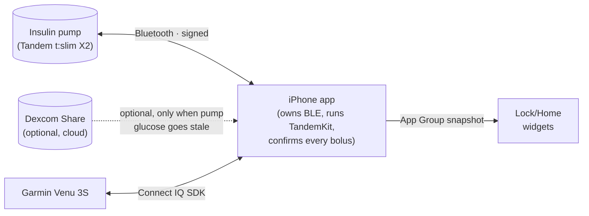

# How it works

A quick tour of the pieces and who's responsible for what. You don't need this to build or use
the app — it's here if you're curious or want to contribute.

## The big picture

**One rule organizes everything: only the iPhone talks to the pump.** The Garmin Venu 3S and the
Lock/Home Screen widgets are *remotes* — they ask the iPhone to do something, and the iPhone is
the one device that owns the Bluetooth connection, runs the safety interlocks, and does the actual
delivery.


```mermaid
flowchart LR
    Pump[("Insulin pump\n(Tandem t:slim X2)")]
    Share[("Dexcom Share\n(optional, cloud)")]
    Phone["iPhone app\n(owns BLE, runs TandemKit,\nconfirms every bolus)"]
    Garmin["Garmin Venu 3S"]
    Widgets["Lock/Home\nwidgets"]

    Pump <-->|Bluetooth · signed| Phone
    Share -.->|optional, only when pump\nglucose goes stale| Phone
    Garmin <-->|Connect IQ SDK| Phone
    Phone -->|App Group snapshot| Widgets
```

Glucose normally reaches the phone **through the pump**. **Dexcom Share** (dotted above) is the
one optional add-on: a cloud-polled feed the app falls back to only when the pump's own glucose
goes stale, never in place of a fresh pump reading. See [Glucose (Dexcom
Share)](operate/glucose.md).

## The repositories

```
TandemKit  (Swift package — build once, reuse everywhere)
├── TandemMessages   framing, opcodes, request/response models, packetization, CRC/HMAC
├── TandemAuth       legacy pairing + EC-JPAKE (mbedTLS), per-command signing
└── TandemBLE        Core Bluetooth central

faBolus  (this repo, consumes TandemKit via SPM)
├── Packages/faBolusCore/  contracts + models (RemoteCommand, PumpBackend, GlucoseSource, GlucoseArbiter)
├── Packages/ShareClient/  Dexcom Share API client (vendored from LoopKit, MIT)
├── ios/faBolus/         iOS host app — owns the pump connection; tabbed modern UI
│   └── Data/Sources/    the Dexcom Share glucose source + its stored credentials
├── ios/faBolusWidgets/  Lock/Home Screen widgets (incl. Quick Bolus)
├── schema/                command.schema.json — the single source of truth for the contract
└── docs/                  this site

faBolusGarmin  (separate repo)
└── Connect IQ (Monkey C) remote for the Garmin Venu 3S — pairs to the iPhone app
```

!!! note "The Garmin app lives in its own repo"
    The Garmin (Monkey C) app lives in the separate
    **[faBolusGarmin](https://github.com/faBolus-app/faBolusGarmin)** repo. The *iPhone side* of the
    Garmin bridge (`GarminRemoteBridge`, the Connect IQ Mobile SDK dependency) is part of this app,
    so the two talk over the shared command contract.

!!! note "Other remotes live on `experimental`"
    A few other remote surfaces were built and then scoped out of this narrow-`main` build — each
    is preserved on its own `dev/*` branch, not part of the app you're reading about here (e.g. the
    Apple Watch app's `RemoteLink` WatchConnectivity transport, on `dev/watch-host`).

## Who owns the pump

The iPhone owns the single Bluetooth control connection and runs **TandemKit**. Garmin is a thin
client: it sends a command to the phone, and the phone runs the confirm interlock, recomputes the
dose, and delivers.

**The pump link always wins.** Serving a remote never touches the pump connection — the iPhone's
CoreBluetooth link to the pump lives in TandemKit's `PumpBLEClient`, and the Garmin path into
`AppModel` is a separate route entirely, so a busy or reconnecting remote can't starve, drop, or
delay the pump link. This is structural, not a setting.

## Glucose (Dexcom Share)

Glucose is normally one facet of the pump feed — a t:slim X2 paired with a Dexcom sensor relays
its own readings to faBolus. On top of that, faBolus has a small **`GlucoseSource`** seam (in
`faBolusCore`, modeled on LoopKit's `CGMManager`) for an *independent* backup feed. This version
compiles in exactly one: **Dexcom Share**, a cloud-polled follower selected in Settings.

A **`GlucoseArbiter`** keeps the pump feed primary and switches to Share only when the pump's
glucose goes stale, deduping history so nothing is double-counted. One shared freshness rule
(`GlucoseFreshness`, default 6 min) governs both the pump feed and Share, and a stale reading is
always shown *marked* (greyed, with its age) rather than as a current value. See [Glucose (Dexcom
Share)](operate/glucose.md) for the user-facing side.

## The command contract

`schema/command.schema.json` defines the tiny phone↔remote protocol — fields like `kind`,
`requestId`, `units`, `carbsGrams`, `bgMgdl`, `confirmToken`, and `status`. Both the Swift side
(`faBolusCore/RemoteCommand.swift`) and the Monkey C side generate and validate against it, which is
what keeps the Garmin remote and the phone from drifting apart.

## Byte-exact protocol

Every outgoing pump message in TandemKit is asserted **byte-for-byte equal** to the pumpX2
`cliparser` oracle in tests, and CI re-runs this on every push. A scheduled CI job watches for
upstream protocol drift. This is what makes a hand-ported dosing protocol trustworthy — see the
[TandemKit](https://github.com/faBolus-app/TandemKit) repo.
