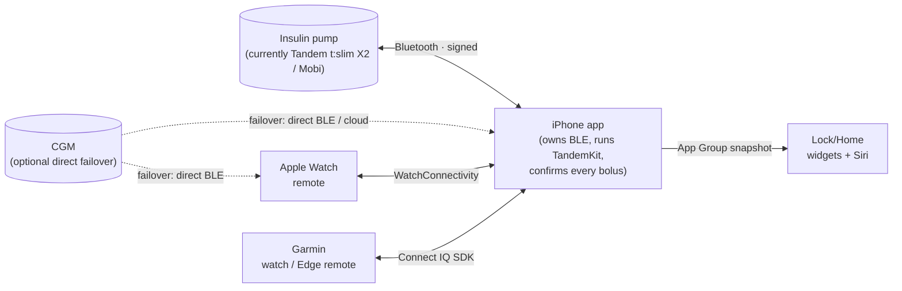

# How it works

A quick tour of the pieces and who's responsible for what. You don't need this to build or use
the app — it's here if you're curious or want to contribute.

## The big picture

**One rule organizes everything: only the iPhone talks to the pump.** The Apple Watch and Garmin
are *remotes* — they send requests to the iPhone, which owns the single Bluetooth connection,
runs the safety interlocks, and does the actual delivery.


```mermaid
flowchart LR
    Pump[("Insulin pump\n(currently Tandem t:slim X2 / Mobi)")]
    CGM[("CGM\n(optional direct failover)")]
    Phone["iPhone app\n(owns BLE, runs TandemKit,\nconfirms every bolus)"]
    Watch["Apple Watch\nremote"]
    Garmin["Garmin\nwatch / Edge remote"]
    Widgets["Lock/Home\nwidgets + Siri"]

    Pump <-->|Bluetooth · signed| Phone
    CGM -.->|failover: direct BLE / cloud| Phone
    CGM -.->|failover: direct BLE| Watch
    Watch <-->|WatchConnectivity| Phone
    Garmin <-->|Connect IQ SDK| Phone
    Phone -->|App Group snapshot| Widgets
```

Glucose normally reaches the phone **through the pump**. An optional [CGM failover](operate/cgm-failover.md)
feed (dotted above) is a *backup* the app uses only when the pump's glucose goes stale — never in
place of a fresh pump reading.

## The repositories

```
TandemKit  (Swift package — build once, reuse everywhere)
├── TandemMessages   framing, opcodes, request/response models, packetization, CRC/HMAC
├── TandemAuth       legacy pairing + EC-JPAKE (mbedTLS), per-command signing
└── TandemBLE        Core Bluetooth central (iOS + watchOS)

faBolus  (this repo, consumes TandemKit via SPM)
├── Packages/faBolusCore/  contracts + models (RemoteCommand, RemoteLink, PumpBackend, GlucoseSource, GlucoseArbiter)
├── Packages/G7SensorKit/  Dexcom G7/ONE+ BLE decoders (vendored from LoopKit, MIT; LoopKit-free)
├── Packages/DexcomG6Kit/   Dexcom G5/G6/ONE passive BLE decoders (vendored from LoopKit/CGMBLEKit, MIT)
├── ios/faBolus/         iOS host app — owns the pump connection; tabbed modern UI
│   └── Data/Sources/    CGM failover impls: cloud (LibreLinkUp, Nightscout, Dexcom Share) + HealthKit + credentials
├── ios/faBolusWidgets/  Lock/Home Screen widgets (incl. Quick Bolus)
├── Shared/                DexcomG7BLESource — passive G7 central (phone-side)
├── schema/                command.schema.json — the single source of truth for the contract
└── docs/                  this site

faBolusGarmin  (separate repo)
└── Connect IQ (Monkey C) remote — Garmin watches + Edge cycling computers; pairs to the iPhone app
```

!!! note "The Garmin app lives in its own repo"
    The Garmin (Monkey C) app lives in the separate
    **[faBolusGarmin](https://github.com/faBolus-app/faBolusGarmin)** repo. The *iPhone side* of the
    Garmin bridge (`GarminRemoteBridge`, the Connect IQ Mobile SDK dependency) is part of this app,
    so the two talk over the shared command contract.

!!! note "The Apple Watch remote is delete-on-main (v0.5.0 narrow-main)"
    `watch/faBolusWatch/` (the Watch app + its WatchConnectivity/direct-G7-failover code) and
    `watch/faBolusWatchWidgets/` (the watch-face complication) are removed from narrow `main` —
    preserved byte-identical on `dev/watch-remote`. The standalone Apple-Watch-as-host/direct-to-pump
    scaffold (`direct-pump/`) is likewise removed, preserved on `dev/watch-host`.

## Who owns the pump

The iPhone owns the single Bluetooth control connection and runs **TandemKit**. Garmin is a thin
client that sends commands to the phone; the phone runs the confirm interlock and delivers. (The
Apple Watch and Mac remotes are removed from narrow `main` — see the notes above and `dev/mac`.)

**The pump link always wins (§5.5).** Serving a remote never touches the pump connection: the iPhone's
CoreBluetooth link to the pump lives in TandemKit's `PumpBLEClient`, while every remote is served through
a *separate* peer/WatchConnectivity/Garmin path into `AppModel` — so a busy or reconnecting remote can't
starve, drop, or delay the pump link. This is structural, not a setting.

**The Mac is a viewer, never a therapist.** The macOS app is a remote client only: it links no pump stack
(`PumpBLEClient`/`TandemBackend` aren't in the Mac target at all) and has no therapy-parameter editor, so
profile/limit/Control-IQ *edits* are iOS-app-only by construction. The Mac can *request* a bolus, which
the phone gates and delivers exactly like any other remote.

**Mac connection persistence across sleep and quit.** macOS CoreBluetooth has no background state
restoration (the iOS `willRestoreState` mechanism doesn't exist there), so the Mac keeps only what it can
re-establish itself: the paired-phone identity and its auth token persist across quit and sleep (in
`MacAuthStore`/`MacPairing`), so on relaunch or wake the Mac reconnects to the same phone automatically
via the stored-token handshake — no re-pairing. On system wake it re-asserts the preferred peer and forces
a fresh status/glucose read (`MacRemoteModel.observeWake`), so pre-sleep values are never shown as current
(the same source-timestamp staleness rule as every other surface still applies if the re-read is slow).
An app *quit* drops the live BLE session (nothing survives it); relaunch re-scans and reconnects by the
persisted identity.

## Glucose sources (CGM failover)

Glucose is normally one facet of the pump feed. On top of that, faBolus has a small **`GlucoseSource`**
seam (in `faBolusCore`, modeled on LoopKit's `CGMManager`) for *independent* CGM feeds used as a
[failover](operate/cgm-failover.md). Each source — Dexcom G7 and G6/G5/ONE passive Bluetooth, LibreLinkUp,
Nightscout, Dexcom Share, Apple Health — conforms to the same interface and is selected in Settings.

A **`GlucoseArbiter`** keeps the pump feed primary and switches to a source only when the pump's
glucose goes stale, deduping history so nothing is double-counted. One shared freshness rule
(`GlucoseFreshness`, default 6 min) governs the pump feed and every source, and a stale reading is
always shown *marked* (greyed, with its age) rather than as a current value. The reverse-engineered
Dexcom G7 decoders are vendored, LoopKit-free, in `Packages/G7SensorKit` and are read-only/passive —
they never authenticate, so they can't disturb the official app or the pump's own connection.

## The command contract

`schema/command.schema.json` defines the tiny phone↔remote protocol — fields like `kind`,
`requestId`, `units`, `carbsGrams`, `bgMgdl`, `confirmToken`, and `status`. Both the Swift side
(`faBolusCore/RemoteCommand.swift`) and the Monkey C side generate and validate against it, which is
what keeps the watch, Garmin, and phone from drifting apart.

## Byte-exact protocol

Every outgoing pump message in TandemKit is asserted **byte-for-byte equal** to the pumpX2
`cliparser` oracle in tests, and CI re-runs this on every push. A scheduled CI job watches for
upstream protocol drift. This is what makes a hand-ported dosing protocol trustworthy — see the
[TandemKit](https://github.com/faBolus-app/TandemKit) repo.
