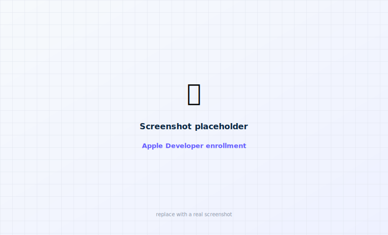

# 1 · Apple account

Before Apple lets you put an app you built onto your own iPhone, it needs to know who you are.
That's all this step is: signing in with an Apple account. It's the same first step as building
Loop — if you've done that, you can reuse the same account and skip ahead.

<figure class="cx2-shot wide" markdown="span">
  
  <figcaption>You'll sign in here once — that's it for the free path</figcaption>
</figure>

## Free or paid — pick one

Both work. The only real difference is how often you have to re-install the app.

-   **Free** start here

    ---

    Costs nothing. The app **stops opening after 7 days**, and you fix that by re-installing from
    the Mac (about a minute). Great for trying it out.

-   **Paid — $99/year** nicer

    ---

    The app lasts **a whole year**, and the widgets and watch app are more reliable. Worth it if
    you'll use this regularly.

!!! tip "You don't have to decide now"
    Start free. You can upgrade to paid later and nothing you've done is wasted.

## Step 1 — Make sure you have an Apple ID

An Apple ID is just the email and password you already use for the App Store or iCloud. You
almost certainly have one.

If you're not sure, on your iPhone open **Settings** and look at the very top — if your name is
there, you have one. If not, tap **Sign in to your iPhone → Create Apple ID** and follow the
prompts.

!!! note "Turn on two-factor if it asks"
    Apple may ask you to switch on **two-factor authentication** (a code sent to your devices).
    Say yes — Apple requires it for building apps.

## Step 2 — Sign in on Apple's website (free path — done here)

<ol class="cx2-steps">
<li>On your Mac, go to <a href="https://developer.apple.com/account/">developer.apple.com/account</a>.</li>
<li>Sign in with your Apple ID.</li>
<li>If it shows an agreement, tick the box to accept it.</li>
</ol>

**That's the free path done.** You can head to [Step 2 · Install Xcode](xcode.md) now.

## Step 3 — Only if you chose paid: enroll

<ol class="cx2-steps">
<li>On the same page, look for <strong>Enroll</strong> (or go to <a href="https://developer.apple.com/programs/enroll/">developer.apple.com/programs/enroll</a>).</li>
<li>Choose <strong>Individual</strong>, pay the $99, and confirm your identity if asked (Apple may use the <strong>Apple Developer</strong> app on your iPhone to do this).</li>
<li>Wait for the approval email — usually quick, sometimes up to a day.</li>
</ol>

!!! tip "You can build while you wait"
    You don't have to wait for the paid approval. Build with the free path now, and switch Xcode
    to your paid account later — it's a one-click change in [Step 3](build-app.md#your-team).

**You're set** when you've signed in at developer.apple.com at least once. Next:
[Install Xcode →](xcode.md)

