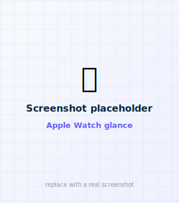
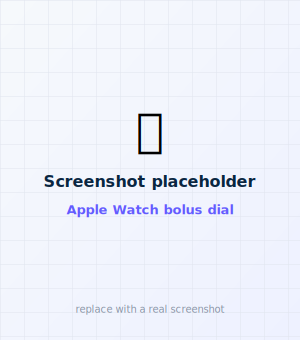

# 4 · Add the Apple Watch (optional)

The Apple Watch remote is **optional** and rides along with the iPhone app you already built.
It never touches the pump itself — it relays bolus requests to your iPhone, which owns the
connection and confirms every request. (See [Apple Watch remote](../remotes/apple-watch.md) for
how it works day to day.)

<figure class="cx2-shot watch" markdown="span">
  
  <figcaption>Glance: glucose, trend, IOB, reachability</figcaption>
</figure>
<figure class="cx2-shot watch" markdown="span">
  
  <figcaption>Dial units with the Digital Crown</figcaption>
</figure>

## Before you start

- You've already completed [Build the iPhone app](build-app.md). The watch app is **included by
  default** when you generate the project, so it's already a target in your Xcode project — nothing
  extra to download.
- You installed the **watchOS** platform in Xcode (from [step 2](xcode.md)). If you skipped it:
  **Xcode → Settings → Components** and add the watchOS simulator/runtime.
- Your Apple Watch is paired to the iPhone you're installing to.

!!! note "Built the phone app without the watch?"
    Only relevant if you used the command-line `FABOLUS_WATCH=0` flag (see
    [Advanced](advanced.md)) — then the watch app isn't in your project and the app's **Remotes &
    devices** settings section says so. Re-run `./scripts/generate-project.sh` (with `FABOLUS_WATCH`
    unset) to include it, then reopen the project.

## Step A — Confirm the watch target is signed

The watch app is a separate *target* in the same project, so it needs your team too.

<ol class="cx2-steps">
<li>In Xcode, click the blue <strong>faBolus</strong> project at the top of the sidebar.</li>
<li>Under <strong>TARGETS</strong>, select <strong>faBolusWatch</strong>.</li>
<li>On <strong>Signing &amp; Capabilities</strong>, tick <strong>Automatically manage signing</strong> and set your <strong>Team</strong>.</li>
<li>Nothing to change by hand here — the watch target's bundle ID is derived automatically from your <code>APP_BUNDLE_ID</code> (it becomes <code>&lt;your id&gt;.watch</code>).</li>
</ol>

## Step B — Choose the watch and run

<ol class="cx2-steps">
<li>In the device menu at the top of Xcode, choose the <strong>faBolusWatch</strong> scheme, then your <strong>Apple Watch</strong> as the destination. (If your watch isn't listed, open the Watch app on your iPhone once, and make sure the watch is unlocked and nearby.)</li>
<li>Press <strong>▶ Run</strong> (<kbd>⌘</kbd> + <kbd>R</kbd>).</li>
<li>The app installs to the watch. The first install over the air can take a few minutes.</li>
</ol>

!!! tip "If installing to the watch is slow or fails"
    Watch installs are notoriously finicky. Try: keep the watch on its charger and unlocked;
    install the **phone** app first and let it settle; then install the watch app. You can also
    install it later from the **Watch** app on the iPhone (**My Watch → Available Apps →
    faBolus → Install**) once the phone app is on the device.

## Step C — Open it on the watch

Press the Digital Crown to see your apps and tap **faBolus**. The glance appears; if your
iPhone is nearby and connected to a pump, live data fills in within a few seconds.

**Success looks like:** the faBolus app on your Apple Watch shows glucose, trend, and Active
Insulin, plus whether the iPhone is reachable.

Learn how to use it — including the bolus flow — on the
[Apple Watch remote](../remotes/apple-watch.md) page.

Next (optional): [Add a Garmin :material-arrow-right:](garmin-build.md)
