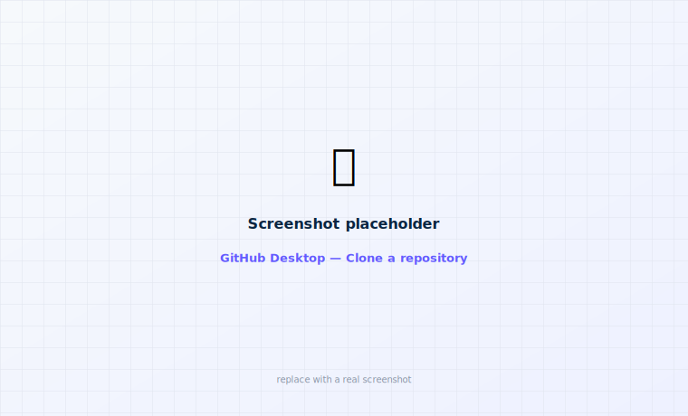
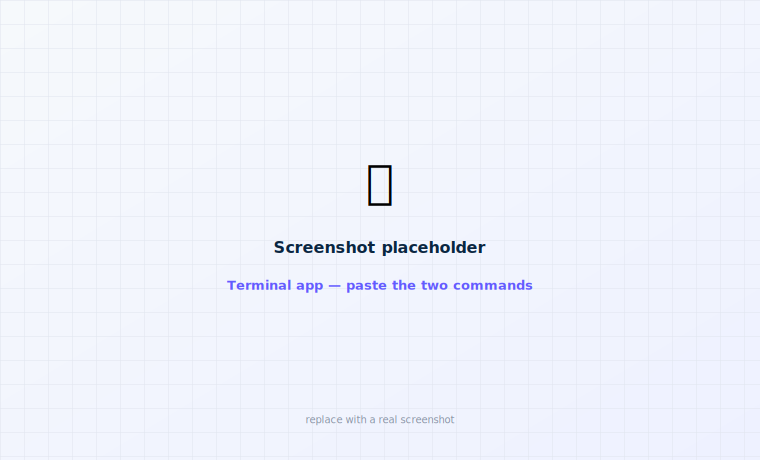

# 3 · Put the app on your iPhone

This is the main event. We'll download the app's code, do one short setup step, then press **Run**
in Xcode to install it on your phone. Do the steps in order and you'll be fine — most of it is
pointing and clicking.

!!! tip "Almost no typing"
    We use a free app called **GitHub Desktop** to download the code (no commands), and **Finder**
    to move one file. There is exactly **one** step that uses the Terminal, and it's spelled out
    word-for-word when we get there.

## Step 1 — Download the code {#download}

The app comes in two parts that must sit next to each other: **faBolus** (the app) and
**PumpX2Kit** (a helper library it's built on). The easiest way to download both — and everything
they need — is **GitHub Desktop**, a free app from GitHub.

!!! info "What's GitHub? What's a repository?"
    **GitHub** is a website where code is stored and shared. A **repository** (or "repo") is just
    a project folder on GitHub. "Cloning" a repo means downloading a copy to your Mac. GitHub
    Desktop does this with a button instead of commands.

<figure class="cx2-shot wide" markdown="span">
  
  <figcaption>GitHub Desktop → File → Clone Repository → paste the URL</figcaption>
</figure>

<ol class="cx2-steps">
<li>Download <strong>GitHub Desktop</strong> from <a href="https://desktop.github.com/">desktop.github.com</a> and open it. (You can sign in with a free GitHub account, or skip sign-in — either works for downloading.)</li>
<li>In the menu bar: <strong>File → Clone Repository…</strong> → click the <strong>URL</strong> tab.</li>
<li>Paste this and set the <strong>Local Path</strong> so it saves into a folder called <code>faBolus</code> inside your <strong>Documents</strong> — for example <code>~/Documents/faBolus/PumpX2Kit</code>:
<div></div>
```
https://github.com/zgranowitz/PumpX2Kit
```
Click <strong>Clone</strong> and wait for it to finish.</li>
<li>Do it again for the second project: <strong>File → Clone Repository…</strong> → <strong>URL</strong>, and this time paste:
<div></div>
```
https://github.com/zgranowitz/faBolus
```
Save it right next to the first one — <code>~/Documents/faBolus/faBolus</code>.</li>
</ol>

<div class="cx2-check" markdown>
**Success looks like:** inside **Documents → faBolus** you now have two folders:
**PumpX2Kit** and **faBolus**, side by side.
</div>

??? note "Advanced: prefer the Terminal? (optional)"
    If you'd rather use the command line, this does the same thing (the `--recurse-submodules`
    part is what GitHub Desktop does automatically):

    ```sh
    mkdir -p ~/Documents/faBolus && cd ~/Documents/faBolus
    git clone --recurse-submodules https://github.com/zgranowitz/PumpX2Kit.git
    git clone https://github.com/zgranowitz/faBolus.git
    ```

## Step 2 — Add the Garmin helper file {#connectiq}

The app is wired to talk to Garmin watches, so it needs one file from Garmin to build — **even if
you never use a Garmin.** You download it once and drop it into a folder. No commands.

<ol class="cx2-steps">
<li>Go to the <a href="https://developer.garmin.com/connect-iq/sdk/">Garmin Connect IQ SDK page</a> and download the <strong>Connect IQ Companion (Mobile) SDK for iOS</strong>. (You'll make a free Garmin account and accept their license.)</li>
<li>In your <strong>Downloads</strong>, double-click the zip to unzip it. You'll get a folder named something like <code>connectiq-companion-app-sdk-ios-1.8.0</code>.</li>
<li>Open <strong>Finder</strong> → go to your <strong>Documents</strong> folder → make a <strong>new folder</strong> called <code>vendor</code> (right-click → New Folder).</li>
<li><strong>Drag</strong> the unzipped Garmin folder into that <code>vendor</code> folder.</li>
</ol>

<div class="cx2-check" markdown>
**Success looks like:** **Documents → vendor** contains the
`connectiq-companion-app-sdk-ios-1.8.0` folder. (So `Documents` now has both a **faBolus**
folder and a **vendor** folder.)
</div>

??? note "If you saved things somewhere else"
    The app looks for the Garmin folder two levels up from itself, in a `vendor` folder. If you
    put your projects somewhere other than `Documents/faBolus`, either move things to match the
    layout above, or open `faBolus/project.yml` in **TextEdit**, find the line under
    `ConnectIQ:` that starts with `path:`, and change it to the full path of your Garmin folder.
    (Re-do Step 3 afterward.)

## Step 3 — Create the project (the one Terminal step)

The project is described by a small text file, and a tiny free tool called **XcodeGen** turns it
into the file Xcode opens. This is the only step that uses the **Terminal**. It's two commands —
just copy, paste, and press Return.

!!! info "What's the Terminal?"
    The **Terminal** is a Mac app where you type commands instead of clicking. Find it in
    **Applications → Utilities → Terminal**. You don't need to understand the commands — copy each
    one, paste it in, and press Return. It's safe.

<figure class="cx2-shot wide" markdown="span">
  
  <figcaption>Paste each line, press Return, wait for it to finish before the next</figcaption>
</figure>

**3a. Install XcodeGen (one time).** This uses **Homebrew**, the standard way to install small
Mac tools. Paste this line and press Return; if it asks for your Mac password, type it (you won't
see the characters — that's normal) and press Return:

```sh
brew install xcodegen
```

??? note "\"command not found: brew\" — install Homebrew first (one time)"
    If you've never used Homebrew, install it by pasting this line, pressing Return, and following
    the prompts — then run `brew install xcodegen` again:

    ```sh
    /bin/bash -c "$(curl -fsSL https://raw.githubusercontent.com/Homebrew/install/HEAD/install.sh)"
    ```

**3b. Create the project.** Now point the Terminal at your app folder and run XcodeGen. The
easiest way to avoid typing the folder path: type `cd` and a space, then **drag the faBolus
folder from Finder into the Terminal window** (it fills in the path for you), then press Return:

```sh
cd ~/Documents/faBolus/faBolus
xcodegen generate
```

<div class="cx2-check" markdown>
**Success looks like:** the Terminal prints something like *"Created project at …faBolus.xcodeproj"*,
and a new **faBolus.xcodeproj** file appears in the faBolus folder.
</div>

## Step 4 — Open the project in Xcode

In Finder, open **Documents → faBolus → faBolus** and **double-click**
**`faBolus.xcodeproj`**. Xcode opens.

Give it a minute — a bar near the top says it's "resolving packages" (downloading the helper
library). Wait for that to finish.

## Step 5 — Choose your Team (signing) {#your-team}

"Signing" is Xcode proving the app is yours. This trips people up, so go slowly.

<figure class="cx2-shot wide" markdown="span">
  
  <figcaption>Signing &amp; Capabilities → tick "Automatically manage signing" → pick your Team</figcaption>
</figure>

<ol class="cx2-steps">
<li>In the tall left panel, click the blue <strong>faBolus</strong> icon at the very top.</li>
<li>In the list that appears, under <strong>TARGETS</strong>, click <strong>faBolus</strong>.</li>
<li>Along the top of the middle area, click the <strong>Signing &amp; Capabilities</strong> tab.</li>
<li>Tick the box <strong>Automatically manage signing</strong>.</li>
<li>In the <strong>Team</strong> dropdown, pick your name (the account from <a href="apple-developer.md">Step 1</a>).</li>
</ol>

Then do the same **Team** choice for the other rows in the TARGETS list:
**faBolusWidgets**, **faBolusWatch**, and **faBolusWatchWidgets**.

!!! warning "Free account? A red \"identifier is not available\" message is normal"
    Every app needs a name that's unique across everyone in the world. The project comes with
    `com.zgranowitz.controlx2`, which is already taken. Change the first part to your own — for
    example `com.janesmith` — so it's unique to you:

    1. Open `faBolus/project.yml` in **TextEdit**.
    2. Use **Edit → Find → Replace** to change every `com.zgranowitz` to your own `com.yourname`
       (keep the endings like `.widgets` and `.watch`, and the `group.` line, exactly as they are).
    3. Save, then re-do **Step 3b** (`xcodegen generate`) and reopen the project.

    This is a normal one-time fix.

!!! info "Free account and widgets"
    Free accounts sometimes can't set up the widgets. If a widget row shows a signing error, you
    can still install the main app — just build **faBolus** for now and add widgets later on a
    paid account.

## Step 6 — Turn on Developer Mode on your iPhone

Newer iPhones need "Developer Mode" switched on before they'll run an app you built.

<figure class="cx2-shot phone" markdown="span">
  
  <figcaption>Settings → Privacy &amp; Security → Developer Mode → on → Restart</figcaption>
</figure>

<ol class="cx2-steps">
<li>On the iPhone, open <strong>Settings</strong> → <strong>Privacy &amp; Security</strong>.</li>
<li>Scroll to the bottom and tap <strong>Developer Mode</strong>.</li>
<li>Turn the switch <strong>on</strong> (green), tap <strong>Restart</strong>, and after it reboots choose <strong>Turn On</strong>.</li>
</ol>

!!! note "Don't see \"Developer Mode\"?"
    It only appears after your phone has been connected to Xcode at least once. If it's missing,
    plug your phone into the Mac with Xcode open (Step 7), then come back here.

## Step 7 — Plug in your iPhone and press Run

<figure class="cx2-shot wide" markdown="span">
  
  <figcaption>Pick your iPhone in the bar at the top, then click the ▶ button</figcaption>
</figure>

<ol class="cx2-steps">
<li>Connect your iPhone to the Mac with a cable.</li>
<li>The first time, the phone shows <strong>Trust This Computer?</strong> — tap <strong>Trust</strong> and enter your passcode.</li>
<li>Near the top-middle of Xcode, click the device menu and choose <strong>your iPhone</strong> (listed under "iOS Device").</li>
<li>Click the <strong>▶</strong> (Run) button at the top-left, or press <kbd>⌘</kbd> + <kbd>R</kbd>.</li>
</ol>

The first build takes a few minutes — let it work. If Xcode says *"Device isn't registered,"*
click to register it (your Mac needs to be online); this is a one-time thing.

## Step 8 — Let your phone trust the app

The first time, iOS won't open an app from a developer it doesn't recognize yet — that developer
is you. You just tell it that's OK.

<figure class="cx2-shot phone" markdown="span">
  
  <figcaption>Settings → General → VPN &amp; Device Management → tap your profile → Trust</figcaption>
</figure>

<ol class="cx2-steps">
<li>On the iPhone: <strong>Settings → General → VPN &amp; Device Management</strong>.</li>
<li>Under <strong>Developer App</strong>, tap your Apple account name.</li>
<li>Tap <strong>Trust</strong>, then confirm.</li>
</ol>

## Step 9 — Open it and allow Bluetooth

Tap the **faBolus** icon on your Home Screen. The first time you tap **Connect**, iOS asks to
use Bluetooth — tap **Allow**. (Without Bluetooth the app can't find your pump.)

<div class="cx2-check" markdown>
**🎉 You did it — the app is on your iPhone.** Until you pair a pump it shows a waiting screen.
Next:

- [Pair it with your pump →](../setup/pairing.md)
- Optional: [add the Apple Watch app](apple-watch-build.md) or [a Garmin](garmin-build.md)
- Learn [what everything does](../operate/status.md)
</div>

!!! note "The app will stop opening after a while — that's normal"
    Free account: after **7 days**. Paid account: after **1 year**. Fixing it takes about a
    minute — see [Keeping the app running](updating.md).
