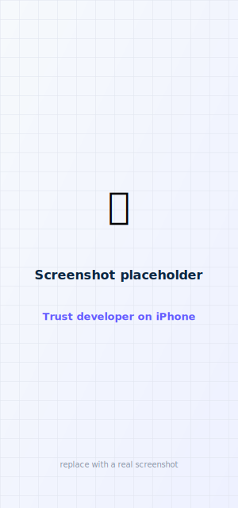

# 3 · Build the iPhone app

This is the main event: download the code, sign it with your account, and run it on your iPhone.
Take it one step at a time — none of it requires programming.

<figure class="cx2-shot wide" markdown="span">
  
  <figcaption>Xcode's Signing &amp; Capabilities tab — where you pick your team</figcaption>
</figure>

## Step A — Download the source code

ControlX2iOS is built on top of the **PumpX2Kit** library, and it expects the two folders to sit
**side by side**. The cleanest way is to make one parent folder and put both inside it.

Open **Terminal** and paste these commands one block at a time:

```sh
# 1) Make a parent folder and go into it
mkdir -p ~/ControlX2 && cd ~/ControlX2

# 2) Download both repositories, including their sub-parts (submodules)
git clone --recurse-submodules https://github.com/zgranowitz/PumpX2Kit.git
git clone https://github.com/zgranowitz/ControlX2iOS.git
```

You should now have `~/ControlX2/PumpX2Kit` and `~/ControlX2/ControlX2iOS`.

!!! warning "Don't skip the submodules"
    PumpX2Kit pulls in a small crypto library (mbedTLS) as a *submodule*. The
    `--recurse-submodules` flag above fetches it. If you ever see build errors about missing
    `mbedtls` files, run this inside the `PumpX2Kit` folder:

    ```sh
    cd ~/ControlX2/PumpX2Kit && git submodule update --init --recursive
    ```

## Step B — Get the Connect IQ companion SDK

The iPhone app talks to the Garmin remote through Garmin's **Connect IQ Mobile SDK for iOS**.
Because of Garmin's license, that SDK isn't included in the repo — you download it once and drop
it in place. **The app needs it even if you never use a Garmin watch**, because the app is wired
to include it.

<ol class="cx2-steps">
<li>Go to the <a href="https://developer.garmin.com/connect-iq/sdk/">Garmin Connect IQ SDK page</a> and download the <strong>Connect IQ Companion (Mobile) SDK for iOS</strong>. You'll need a free Garmin account and to accept Garmin's license.</li>
<li>Unzip it. You want the folder named like <code>connectiq-companion-app-sdk-ios-1.8.0</code> (it contains <code>ConnectIQ.xcframework</code>).</li>
<li>Place that folder where the project expects it. By default <code>project.yml</code> looks for it at <code>../../vendor/…</code> relative to the ControlX2iOS folder. With the layout above, put it here:

<div></div>

```sh
mkdir -p ~/ControlX2/vendor
# move the unzipped SDK folder into ~/ControlX2/vendor/
mv ~/Downloads/connectiq-companion-app-sdk-ios-1.8.0 ~/ControlX2/vendor/
```
</li>
</ol>

!!! tip "If your folders are somewhere else"
    The path is just a line in `ControlX2iOS/project.yml` under `packages: → ConnectIQ: → path:`.
    If you keep the SDK elsewhere, open `project.yml` in any text editor and point that `path:`
    at your SDK folder. (Re-run `xcodegen generate` after any change to `project.yml`.)

## Step C — Generate the Xcode project

The project is described by `project.yml`; XcodeGen turns it into the `.xcodeproj` Xcode opens.

```sh
cd ~/ControlX2/ControlX2iOS
xcodegen generate
```

You'll see it create **ControlX2.xcodeproj**.

## Step D — Open it in Xcode

```sh
open ControlX2.xcodeproj
```

Give Xcode a moment to "resolve packages" (it's fetching PumpX2Kit) — a progress bar shows at
the top.

## Step E — Signing & Capabilities {#signing}

This is the step people get stuck on, so go slowly.

<ol class="cx2-steps">
<li>In the left sidebar, click the blue <strong>ControlX2</strong> project icon at the very top.</li>
<li>Under <strong>TARGETS</strong>, select <strong>ControlX2</strong>.</li>
<li>Open the <strong>Signing &amp; Capabilities</strong> tab.</li>
<li>Tick <strong>Automatically manage signing</strong>.</li>
<li>Set <strong>Team</strong> to your Apple ID team (from <a href="xcode.md">step 2</a>).</li>
</ol>

Repeat the **Team** selection for the other targets too: **ControlX2Watch** and
**ControlX2Widgets** (select each under TARGETS and pick the same team).

!!! warning "Free accounts: you'll likely need to change the bundle identifiers"
    Every app on Apple's system needs a globally-unique **Bundle Identifier**. The project ships
    with `com.zgranowitz.controlx2`. On a **free** account (or any account that isn't
    zgranowitz's), Xcode will complain that identifier is taken. Fix it by choosing your own
    prefix — for example replace `com.zgranowitz` with `com.yourname` **everywhere it appears**:

    - In `project.yml`: `bundleIdPrefix`, each target's `PRODUCT_BUNDLE_IDENTIFIER`, and the
      App Group `group.com.zgranowitz.controlx2`.
    - Then re-run `xcodegen generate` and reopen the project.

    Keep the *pattern* the same: the widget must stay `<your prefix>.widgets`, the watch
    `<your prefix>.watch`, and the App Group `group.<your prefix>`. They have to match so the app
    and its widgets can share data.

!!! info "Free accounts and the App Group / widgets"
    A free "Personal Team" sometimes can't register **App Groups** or app extensions. If signing
    the **ControlX2Widgets** target fails on a free account, you can still run the main app —
    build just the phone app for now, and revisit widgets once you're on the paid program. (See
    [Troubleshooting](../troubleshoot.md).)

## Step F — Plug in your iPhone and run

<figure class="cx2-shot wide" markdown="span">
  
  <figcaption>Pick your iPhone from the device menu, then press the ▶ Run button</figcaption>
</figure>

<ol class="cx2-steps">
<li>Connect your iPhone to the Mac with a cable. If the phone asks, tap <strong>Trust This Computer</strong> and enter your passcode.</li>
<li>Turn on <strong>Developer Mode</strong> on the iPhone if prompted: <strong>Settings → Privacy &amp; Security → Developer Mode</strong> → on, then restart the phone.</li>
<li>In Xcode, click the device menu near the top (it may say a simulator name) and choose <strong>your iPhone</strong> under "iOS Device".</li>
<li>Press the <strong>▶ Run</strong> button (top-left) or press <kbd>⌘</kbd> + <kbd>R</kbd>.</li>
<li>Xcode builds the app and installs it. The first build takes a few minutes.</li>
</ol>

## Step G — Trust the app on your iPhone

The first time, iOS won't open an app from a developer it doesn't yet trust.

<figure class="cx2-shot phone" markdown="span">
  
  <figcaption>Settings → General → VPN &amp; Device Management → trust your developer profile</figcaption>
</figure>

<ol class="cx2-steps">
<li>On the iPhone: <strong>Settings → General → VPN &amp; Device Management</strong>.</li>
<li>Under <strong>Developer App</strong>, tap your Apple ID / developer profile.</li>
<li>Tap <strong>Trust</strong>, then confirm.</li>
<li>Now tap the <strong>ControlX2</strong> icon on your Home Screen to open it.</li>
</ol>

## Step H — Grant Bluetooth permission

The first time you tap **Connect**, iOS asks to allow Bluetooth. Tap **Allow** — the app can't
find your pump without it.

## You're done 🎉

<figure class="cx2-shot phone" markdown="span">
  
  <figcaption>The app running on your iPhone (showing sample data until you pair)</figcaption>
</figure>

Until you pair with a pump, the on-device app shows a live status screen waiting for a
connection. Next:

- [Pair with your pump :material-arrow-right:](../setup/pairing.md)
- Or add the [Apple Watch app](apple-watch-build.md) and the [Garmin remote](garmin-build.md).
- Then learn [what everything does](../operate/status.md) and how to
  [customize it](../customize/settings.md).

!!! note "Remember the 7-day / 1-year clock"
    On a free account the app stops opening after 7 days; on the paid program it lasts a year.
    See [Keeping the app running](updating.md) for the (quick) reinstall.
