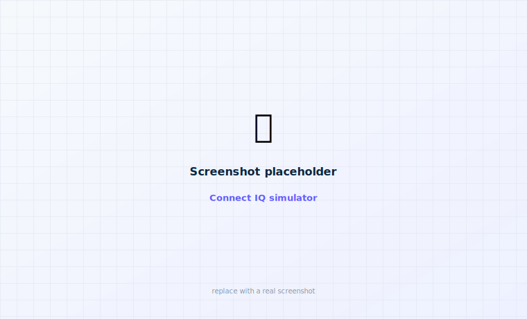

# 5 · Build the Garmin remote

The Garmin remote is **optional**. It's a small **Connect IQ** app (Garmin's app platform) for
the **Garmin venu3s** that relays bolus requests to your iPhone — the phone owns the pump
connection and confirms every request. It also shows a glucose complication and a Dexcom-style
history plot. (See [Garmin remote](../remotes/garmin.md) for day-to-day use.)

!!! note "The Garmin app lives in its own repo"
    The Garmin watch app is now in the separate
    **[PumpX2Garmin](https://github.com/zgranowitz/PumpX2Garmin)** repo, not in `ControlX2iOS`.
    The *iPhone side* of the bridge is already part of the ControlX2 app you built in
    [step 3](build-app.md) (it links Garmin's Connect IQ Mobile SDK), so all you do here is build
    the watch app and pair it.

Garmin uses a **different toolchain** from the iPhone app, so this page is a bit more technical.
Take your time.

<div class="cx2-shots" markdown>
<figure class="cx2-shot watch" markdown="span">
  
  <figcaption>Glance</figcaption>
</figure>
<figure class="cx2-shot watch" markdown="span">
  
  <figcaption>History plot</figcaption>
</figure>
<figure class="cx2-shot watch" markdown="span">
  
  <figcaption>Tap 1-2-3 to confirm</figcaption>
</figure>
</div>

## What you'll need

- The **iPhone app already built** ([step 3](build-app.md)) — the Garmin remote is useless
  without it, since the phone does the actual pump communication.
- The **Garmin Connect IQ SDK** and a **developer key** (both free).
- The **Garmin Connect Mobile** app on your iPhone, with your **venu3s** paired to it.

## Step A — Get the Garmin app source

```sh
cd ~/ControlX2
git clone https://github.com/zgranowitz/PumpX2Garmin.git
```

## Step B — Install the Connect IQ SDK

The friendliest way is the **Connect IQ extension for Visual Studio Code**, which bundles the SDK
manager, compiler, and simulator.

<ol class="cx2-steps">
<li>Install <a href="https://code.visualstudio.com/">Visual Studio Code</a> (free).</li>
<li>Inside VS Code, open the <strong>Extensions</strong> panel and install <strong>Monkey C</strong> (published by Garmin).</li>
<li>Run <strong>Monkey C: Verify Installation</strong> (command palette: <kbd>⌘</kbd> + <kbd>⇧</kbd> + <kbd>P</kbd>). It walks you through downloading the <strong>SDK</strong> and the <strong>venu3s device</strong> files.</li>
</ol>

Prefer the command line? Download the SDK from the
[Connect IQ SDK page](https://developer.garmin.com/connect-iq/sdk/) and add its `bin/` to your
`PATH` so `monkeyc` and `connectiq` are available.

## Step C — Create a developer key

=== "In VS Code"

    Run **Monkey C: Generate a Developer Key** and let it save the key.

=== "In Terminal (OpenSSL)"

    ```sh
    openssl genrsa -out ~/ControlX2/developer_key.pem 4096
    openssl pkcs8 -topk8 -inform PEM -outform DER \
      -in ~/ControlX2/developer_key.pem \
      -out ~/ControlX2/developer_key.der -nocrypt
    ```

## Step D — Build the watch app

The sources are in the PumpX2Garmin repo you cloned.

=== "In VS Code"

    <ol class="cx2-steps">
    <li>Open the <strong>PumpX2Garmin</strong> folder in VS Code.</li>
    <li><kbd>⌘</kbd> + <kbd>⇧</kbd> + <kbd>P</kbd> → <strong>Monkey C: Build Current Project</strong>, or <strong>Monkey C: Run</strong> to build and launch the simulator.</li>
    <li>When asked for a device, choose <strong>venu3s</strong>.</li>
    </ol>

=== "In Terminal"

    ```sh
    cd ~/ControlX2/PumpX2Garmin
    SDK=~/Library/Application\ Support/Garmin/ConnectIQ/Sdks/<sdk-version>
    "$SDK/bin/monkeyc" -f monkey.jungle -o bin/ControlX2.iq -y ~/ControlX2/developer_key.der -e -r -w
    ```

    (Check the repo's own README for the exact target/flags.)

## Step E — Try it in the simulator

<figure class="cx2-shot wide" markdown="span">
  
  <figcaption>The Connect IQ simulator (venu3s) — check the screens before sideloading</figcaption>
</figure>

In VS Code, **Monkey C: Run** opens the **Connect IQ simulator** with your app on a virtual
venu3s. It can't reach your iPhone/pump, so bolus flows show the out-of-range path there — but
it's the best place to check the screens and taps.

## Step F — Put it on your venu3s

Sideload the built app in the simulator, or upload `bin/ControlX2.iq` to the Connect IQ store as
a beta and install it from Garmin Connect Mobile onto the watch.

## Step G — Pair the remote to your iPhone

<ol class="cx2-steps">
<li>Make sure <strong>Garmin Connect Mobile</strong> is installed and your venu3s is paired to it.</li>
<li>Open the <strong>ControlX2</strong> iPhone app, tap the <strong>watch icon</strong> (top-right) → <strong>Set up Garmin remote</strong>. This opens Garmin Connect so you can pick your venu3s.</li>
<li>Return to ControlX2 — it remembers the device and the HUD shows "Garmin remote: &lt;your watch&gt; ✓".</li>
</ol>

## What you should have now

- [x] The PumpX2Garmin app built and running in the Connect IQ simulator.
- [x] The app on your venu3s.
- [x] The venu3s selected as your Garmin remote inside the iPhone app.

Head to [Garmin remote](../remotes/garmin.md) to learn the screens, history plot, complication,
and the tap-1-2-3 bolus confirmation.
