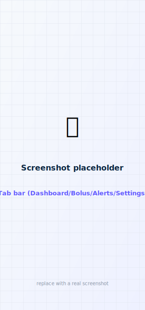
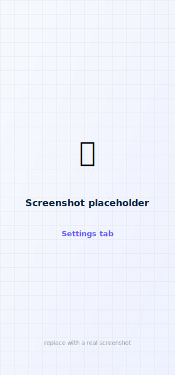
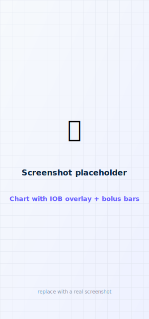

# Settings & options

faBolus has a dedicated **Settings** tab (the app is organized as **Dashboard · Bolus · Alerts ·
Settings**). This page covers everything you can adjust; most settings are shared with the Apple
Watch and Garmin remotes so all three behave consistently.

<figure class="cx2-shot phone" markdown="span">
  
  <figcaption>Dashboard · Bolus · Alerts · Settings</figcaption>
</figure>
<figure class="cx2-shot phone" markdown="span">
  
  <figcaption>The Settings tab</figcaption>
</figure>

## Bolus defaults & increments

- **Default bolus mode** — open the bolus screen in **Carbs** or **Units**.
- **Bolus increment** — the step size for the units stepper (e.g. 0.01 / 0.05 / 0.1 / 0.5 / 1 / 2 U).
- **Carb increment** — the step size for carb entry (e.g. 1 / 5 / 10 / 15 g).
- **Watch & Garmin increments** — a separate set applied on the remotes, so the wrist can use
  bigger steps than the phone.

These propagate to the Apple Watch and Garmin (default mode on open, and the − / + step).

## Dashboard chart

<figure class="cx2-shot phone" markdown="span">
  
  <figcaption>Glucose with an IOB overlay and bolus bars</figcaption>
</figure>

- **Time window** — 3 / 6 / 12 / 24 h.
- **IOB overlay** — a second axis showing insulin-on-board over time (toggleable).
- **Bolus bars** — vertical bars at each bolus, height ∝ units (toggleable).

Both axes can be turned on/off independently.

## Connecting & pairing

The **Connect** control adapts to your state — first-time pairing (enter the 6-digit code),
**Connect (saved pairing)** to reconnect with no code, and **Re-pair with new code** after a pump
reset. The app auto-reconnects to a saved pump and uses iOS state restoration in the background.
See [Pairing](../setup/pairing.md).

## Garmin remote

**Settings → Garmin remote → Screen order** lets you drag to reorder the Garmin screens (Glance /
Alerts / History / Details) and pick which opens first. The layout is pushed to the watch and
remembered there. See [Garmin remote](../remotes/garmin.md).

## Siri & Shortcuts

The Settings tab lists the read-only **Siri** phrases for reference. Full details, plus the
value-returning **Shortcuts** actions you can use in automations, are on
[Siri & Shortcuts](shortcuts.md).

## Safety behaviors you can rely on (not configurable)

Always on by design:

- A CGM reading older than **6 minutes** is hidden everywhere (phone, watch, widgets, Siri).
- Every bolus needs an **explicit confirmation**; remote requests are confirmed deliberately, and
  the **Quick Bolus** widget requires a 1-2-3 tap.
- Every insulin-affecting command is **cryptographically signed** — the pump rejects anything
  that isn't.
- There is **no voice/automated bolus** — Siri is read-only.
