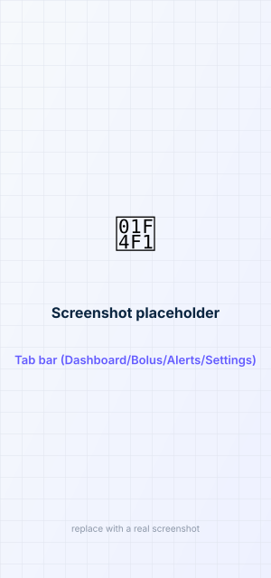
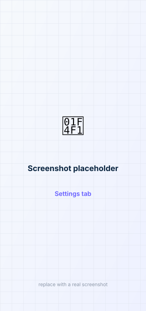
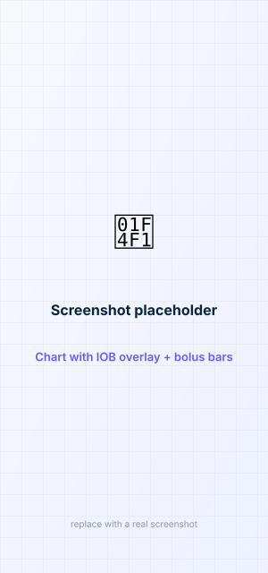

# Settings & options

faBolus has a dedicated **Settings** tab (the app is organized as **Dashboard · Bolus · Alerts ·
Settings**). This page covers everything you can adjust. Most bolus and display settings are
shared with the Garmin remote, set independently from the phone, so the two stay consistent
without forcing the same numbers on a small screen.

<figure class="cx2-shot phone" markdown="span">
  
  <figcaption>Dashboard · Bolus · Alerts · Settings</figcaption>
</figure>
<figure class="cx2-shot phone" markdown="span">
  
  <figcaption>The Settings tab</figcaption>
</figure>

## Bolus & entry

- **Phone default mode** — open the bolus screen on the phone in **Carbs** or **Units**.
- **Garmin default mode** — the same choice for the watch, set independently of the phone.
- **Unit increment** — the step size for the units stepper (e.g. 0.01 / 0.05 / 0.1 / 0.5 / 1 / 2 U).
- **Carb increment** — the step size for carb entry (e.g. 1 / 5 / 10 / 15 g).
- **Garmin increments** — a separate unit/carb step size for the watch, so it can use bigger steps
  than the phone.
- **Show recommendation reasoning** — the collapsible breakdown under the recommended dose; see
  [Bolus & cancel](../operate/bolus.md#recommendation-reasoning).

## Display & chart

<figure class="cx2-shot phone" markdown="span">
  
  <figcaption>Glucose with an IOB overlay and bolus bars</figcaption>
</figure>

- **Time window** — 3 / 6 / 12 / 24 h.
- **IOB overlay** — a second axis showing insulin-on-board over time (toggleable).
- **Bolus bars** — vertical bars at each bolus, height ∝ units (toggleable).
- **Plot ceiling / floor** — preset high/low bounds for the glucose chart's y-axis, so it doesn't
  stretch to fit one outlier reading.
- **Show statistics card** — see [Dashboard & status](../operate/status.md#statistics-card).

Both chart axes toggle on/off independently. A **Customize** section under the same screen lets you
drag-reorder or hide the **details card rows** and **dashboard pills** — the same customization is
available for the watch's own Details page, independently, under Remotes & devices below.

## Connecting & pairing

The **Connect** control adapts to your state — first-time pairing (enter the 6-digit code),
**Connect (saved pairing)** to reconnect with no code, and **Re-pair with new code** after a pump
reset. The app auto-reconnects to a saved pump and uses iOS state restoration in the background.
See [Pairing](../setup/pairing.md).

## Glucose (Dexcom Share)

Under **Settings → CGM & failover**, pick **Dexcom Share** from the **Failover CGM** picker to add
it as an independent fallback for when the pump's own glucose goes stale, then open **CGM
credentials & testing** to enter your Share account. See [Glucose (Dexcom
Share)](../operate/glucose.md) for the full setup and what "failover" actually means here — there's
no live multi-source switching, just one optional fallback. The same screen has **Glucose
staleness**, where you can adjust how long a reading stays "current" before it's marked stale.

## Garmin bolusing

Under **Settings → Remotes & devices**, **Allow bolusing from Garmin** is off by default — you
confirm a one-time warning the first time you turn it on. Once it's on you can also **limit remote
bolus size** (a cap on top of your pump's own max bolus) and, optionally, **require a 4-digit
passcode** to bolus from the watch instead of the usual tap-to-confirm — useful since a Garmin has
no wrist detection to confirm it's actually on your arm. A separate **read-only (view only)** switch
overrides all of it: while it's on, the watch shows pump and CGM data only, no matter what the
bolusing switch says. See [Garmin remote](../remotes/garmin.md) for how the confirm and passcode
flows look on the watch itself.

## Garmin remote

**Settings → Garmin remote → Screen order** lets you drag to reorder the Garmin screens (Glance /
Alerts / History / Details) and pick which opens first. The layout is pushed to the watch and
remembered there. See [Garmin remote](../remotes/garmin.md).

## Notifications

**Settings → Notifications** groups alert delivery by source: pump-relayed alerts and several
app-generated categories each get their own enable / quiet-hours / critical-break-through controls,
an **Interruption Strength** section holds the **Use Critical Alerts** toggle, and **Safety
alerts** covers the three that are on by default and always break through quiet hours and Do Not
Disturb (pump disconnected, CGM data lost, unresolved bolus). Each of those three has its own
switch if you ever want to turn it off, but doing so asks you to confirm a warning specific to that
alert first. See [Alerts & alarms](../operate/alerts.md) for what each notification looks like and
how clearing works on the t:slim X2.

## Safety (read-only mode)

**Settings → Safety** has a **Read-only mode** switch that turns your phone into a safe viewer —
bolusing and pump control are disabled and their screens hidden, which is useful for a caregiver or
a spare phone that should only watch pump and CGM data. A sub-toggle, **Still allow clearing
alerts**, lets that phone keep clearing notifications even in read-only mode. The Garmin remote has
its own independent read-only switch, under Garmin bolusing above.

## Privacy & data

**Settings → Privacy & data** holds the two data-wipe controls — see [Erase & full
reset](../operate/erase.md).

## Safety behaviors you can rely on (not configurable)

Always on by design:

- A CGM reading older than **6 minutes** is treated as stale — shown greyed with its age on the
  phone and Garmin, and greyed on the Quick-Bolus widget until it's hidden entirely. It's never
  presented as the live value.
- Every bolus needs an **explicit confirmation**; remote requests are confirmed deliberately, and
  the **Quick Bolus** widget requires a 1-2-3 tap.
- Every insulin-affecting command is **cryptographically signed** — the pump rejects anything
  that isn't.
- There is **no voice or automated bolus** — nothing in faBolus can start a dose on its own.
