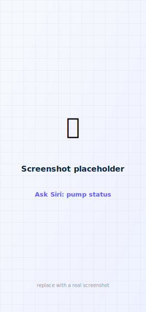

# Siri & Shortcuts

faBolus registers a set of **read-only** Siri intents and Shortcuts actions so you can check
your pump hands-free and wire it into automations. They read the latest snapshot the app
publishes to the App Group — the same data the widgets show — so they answer instantly without
opening the app or driving Bluetooth.

<figure class="cx2-shot phone" markdown="span">
  
  <figcaption>"Hey Siri, pump status in Pump Remote"</figcaption>
</figure>

!!! danger "No voice or automated bolus — by design"
    There is **no Siri/Shortcuts bolus action**. A bolus is always a deliberate, confirmed action
    on the phone, Apple Watch, or Garmin. The only action Shortcuts exposes is *Open Bolus
    Screen*, which opens the app so you can enter and confirm the dose yourself. As everywhere in
    this project, any delivery is **experimental.**

## Ask Siri

| Ask | Answers with |
|-----|--------------|
| "Glucose in faBolus" | latest glucose + trend + age |
| "Insulin on board in faBolus" | current IOB |
| "Pump status in faBolus" | glucose, IOB, reservoir, battery, connection |
| "Last bolus in faBolus" | most recent bolus + when |
| "Any alerts in faBolus" | active pump alerts/alarms |

Nothing to turn on — the shortcuts register automatically the first time you launch faBolus
after installing. The phrases are also listed in **Settings → Siri (read-only)** and appear under
faBolus in the **Shortcuts** app.

!!! tip "Say the app name Siri understands"
    App Shortcut phrases must include the app name. faBolus registers spoken alternatives, so any
    of these work in place of the name: **"faBolus"**, **"Pump Remote"**, or **"Fabolus"** — e.g.
    *"Hey Siri, pump status in Pump Remote."*
    After installing, it can take a minute (or a device unlock) for Siri to index the phrases; if
    a phrase isn't recognized yet, open the **Shortcuts** app once to trigger indexing.

## Shortcuts data actions

Beyond the spoken phrases, faBolus exposes a large set of **value-returning** actions in the
**Shortcuts** app so you can build shortcuts and automations (e.g. *"if glucose > 180 and IOB < 1,
send me a notification"*). Each returns a typed value you can pass to other actions:

- **Glucose** — Get Glucose, Get Glucose Trend, Get Glucose Age (minutes), Get Recent Glucose Values
- **Insulin** — Get Insulin on Board, Get Last Bolus (units), Get Last Bolus Age (minutes)
- **Pump** — Get Reservoir, Get Pump Battery, Is Pump Connected, Is CGM Active
- **Settings** — Get Carb Ratio, Get Correction Factor, Get Target Glucose, Get Max Bolus
- **Alerts** — Get Active Alerts (list), Get Alert Count
- **Summary** — Get Pump Summary (one-line string)
- **Action** — Open Bolus Screen (opens the app to the bolus screen — you still confirm the dose)

All data actions are **read-only** and read the last published snapshot (no Bluetooth), so they
run instantly. They're safe to use in time-based or location automations.

## Build a "quick open" shortcut (URL)

You can also drive the app from a shortcut with its built-in links, handy for a Home Screen icon,
**Back Tap**, or a Lock Screen button:

| Link (URL) | What it does |
| --- | --- |
| `fabolus://` | Opens faBolus to the Dashboard. |
| `fabolus://bolus` | Opens the app and jumps to the bolus entry + confirm screen. |

<ol class="cx2-steps">
<li>Open <strong>Shortcuts</strong> → <strong>+</strong> → <strong>Add Action</strong> → <strong>Open URL</strong>.</li>
<li>Enter <code>fabolus://bolus</code> (or <code>fabolus://</code>), name the shortcut, and tap <strong>Done</strong>.</li>
<li>Optionally add it to the Home Screen (<strong>Share → Add to Home Screen</strong>) or to <strong>Back Tap</strong> (<strong>Settings → Accessibility → Touch → Back Tap</strong>).</li>
</ol>

Even from a shortcut, the bolus screen still requires you to enter the amount and confirm.

## Freshness

- A glucose reading older than **6 minutes** is reported as not recent (never spoken as current).
- If the pump isn't connected, the pump-status answer notes the data may be out of date.
- If the app has never connected, Siri asks you to open faBolus and connect first.
