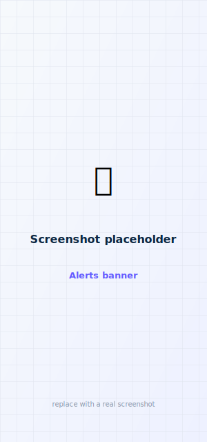

# Alerts & alarms

View and clear the pump's active notifications from the phone or your watch — without reaching
for the pump. On the phone they live on the **Alerts** tab (and as a banner on the Dashboard).

<figure class="cx2-shot phone" markdown="span">
  
  <figcaption>Active notifications, most-serious first, each with Clear</figcaption>
</figure>

## What's shown

The app polls the pump's notification bitmaps frequently and groups them by severity:

| Type | Examples | Can clear? |
| --- | --- | --- |
| **Alarms** (most serious) | Occlusion, empty cartridge | Yes |
| **Alerts** | Low insulin, incomplete bolus, low power | Yes |
| **CGM alerts** | High / low / urgent-low, signal loss | Yes* |
| **Reminders** | Configured reminders | Yes |
| **Malfunctions** | Hardware faults | View-only |

## On the phone and watch

Notifications appear most-serious first, each with a **Clear** button (a signed dismiss sent to
the pump). On the Apple Watch and Garmin, the **Alerts** screen shows the same list — tap a row to
clear it, and the watch relays the request to the phone. (The raw pump bitmaps and poll count are no
longer shown on the Alerts screen — they now live only in the hidden debug panel.)

## Condition-based (CGM) alerts

Some alerts are **condition-based** — most importantly the CGM **high / low glucose** alerts.
While the reading is genuinely out of range the pump re-raises the alert on every poll, so it
**cannot be cleared on the pump** until glucose returns to range (the official Tandem/Dexcom app
behaves the same way — you can only acknowledge/snooze it). In faBolus, tapping **Clear** on
such an alert **snoozes it on your phone**: it's hidden and stops re-notifying for 30 minutes (or
until the pump condition clears). The Alerts screen says so when a CGM alert is active. The pump's
dismiss acknowledgement shows in the diagnostic line (`ack 0 (accepted)` vs `ack N (rejected)` vs
`no ack`).

## How clearing works

Clearing sends a **signed `DismissNotificationRequest`** with the notification's id and kind. It's
signed like a bolus but does **not** modify insulin delivery, so it runs under a restricted
"non-delivery" write policy.

!!! warning "Known issue — clearing doesn't reach the pump yet"
    Clearing currently removes the alert from the **phone and watch UI but does not clear it on the
    pump itself**. The dismiss path is validated by construction (its bytes are asserted exactly and
    it uses the same signing/framing proven byte-exact for boluses), but it isn't yet dismissing on
    the pump in practice. A fix is in progress — don't rely on it to clear alerts on the pump.

## Conditional auto-rules

Under **Settings → Alert rules** you can add rules that automatically **snooze** or **dismiss** alerts
that meet conditions you choose:

- **Time of day** — e.g. quiet CGM highs between 22:00 and 07:00 (a window that ends before it starts
  wraps past midnight).
- **Alert kind** — reminders, alerts, or CGM alerts.
- **Specific alert ids**, and/or a **glucose condition** (only act when glucose is below / above a value).

Rules are checked top to bottom; the first match wins. *Auto-snooze* hides the alert and stops
re-notifying (it re-nags after 30 minutes if still active), like tapping Clear. *Auto-dismiss* does the
same and, on pumps that allow remote dismiss, also clears it on the pump.

!!! warning "Alarms are never auto-handled"
    For safety, **alarms and malfunctions** — the pump's most severe notifications — are never
    auto-snoozed or auto-dismissed, no matter what rules you set.
