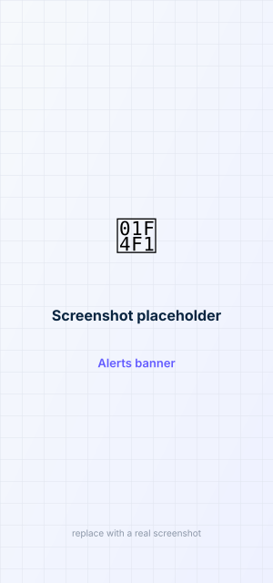

# Alerts & alarms

View and clear the pump's active notifications from the phone or your Garmin watch — without
reaching for the pump. On the phone they live on the **Alerts** tab (and as a banner on the
Dashboard).

<figure class="cx2-shot phone" markdown="span">
  
  <figcaption>Active notifications, most-serious first, each with Snooze</figcaption>
</figure>

## What's shown

The app polls the pump's notification bitmaps frequently and groups them by severity:

| Type | Examples | Can clear? |
| --- | --- | --- |
| **Alarms** (most serious) | Occlusion, empty cartridge | Yes |
| **Alerts** | Low insulin, incomplete bolus, low power | Yes |
| **CGM alerts** | High / low / urgent-low, signal loss | Yes* |
| **Reminders** | Configured reminders | Yes |
| **Malfunctions** | Hardware faults | View-only |

\* See *How clearing works* below — on the t:slim X2, "clear" is really a local snooze.

## On the phone and Garmin

Notifications appear most-serious first, each with a button. Because the t:slim X2 doesn't accept
a remote dismiss, that button always reads **Snooze**, not Clear — tapping it hides the item on
your phone for a while rather than telling the pump to clear it (see *How clearing works* below).
On Garmin, the **Alerts** screen shows the same list — tap a row to snooze it there, and the watch
relays the request to the phone. (The raw pump bitmaps and poll count are no longer shown on the
Alerts screen — they now live only in the hidden debug panel.)

## Condition-based (CGM) alerts

Some alerts are **condition-based** — most importantly the CGM **high / low glucose** alerts.
While the reading is genuinely out of range the pump re-raises the alert on every poll, so it
**cannot be cleared on the pump** until glucose returns to range (the official Tandem/Dexcom app
behaves the same way — you can only acknowledge/snooze it). In faBolus, tapping **Snooze** on
such an alert hides it and stops re-notifying for 30 minutes (or until the pump condition clears).
The Alerts screen says so when a CGM alert is active.

## How clearing works on the t:slim X2

faBolus only pairs with the **t:slim X2** — any other pump model is rejected at pairing (see
[Pairing](../setup/pairing.md)) — and the t:slim X2 doesn't honor a remote dismiss. So tapping
**Snooze** never sends anything to the pump: it just hides the alert on your phone
(`TandemBackend.dismissNotification` skips the send outright, since `supportsRemoteAlertDismiss`
is false for this pump model; the debug panel's diagnostic line reads `local-snoozed … — t:slim X2
rejects remote dismiss`). Clear an acknowledgeable pump alert or alarm on the pump itself if you
want it gone there too. Condition-based CGM alerts (see above) work the same way either way — the
pump keeps re-raising them while glucose is out of range, so faBolus never tries to dismiss them
remotely.

## Critical Alerts — current status

faBolus requests Apple's **Critical Alerts** capability so its safety alerts — pump disconnected,
CGM data lost, unresolved bolus — can break through Do Not Disturb and the ringer switch. That
capability requires a special Apple-issued entitlement
(`com.apple.developer.usernotifications.critical-alerts`), which faBolus does **not** currently
hold.

All three safety alerts are on by default and stay on even during quiet hours or Do Not Disturb;
each has its own switch under **Settings → Notifications → Safety alerts** if you ever need to turn
one off, but doing so asks you to confirm a specific warning about what you'd be giving up.

!!! note "Pending Apple approval — this is expected, not an error"
    Until Apple grants the entitlement, faBolus **degrades gracefully**: an enabled safety alert is
    still delivered every time, just as a **time-sensitive** notification rather than a true
    Critical Alert. Under **Settings → Notifications → Interruption Strength**, the "Use Critical
    Alerts" toggle shows an honest status line — "Critical Alerts aren't active yet — pending Apple
    approval" — for as long as this is the case. This is the normal, everyday pre-approval state and
    can persist for months; it is not a bug.

**How to flip it on once Apple grants the entitlement:** add
`com.apple.developer.usernotifications.critical-alerts` (Boolean `true`) to
`ios/faBolus/faBolus.entitlements` and regenerate the app's **provisioning profile** with the
granted entitlement. No code change is required — the `.critical`/`.defaultCritical` delivery
path already gates purely on the user's own "Use Critical Alerts" setting, and iOS activates true
break-through delivery for an entitled app automatically. The honest-status notice clears itself
once the app's cached grant state reflects the new entitlement.

**Tracking:** filing the Apple approval request is an owner action, tracked in
`.planning/todos/pending/2026-08-13-file-apple-critical-alerts-entitlement-request.md`. Real
Do-Not-Disturb break-through behavior can only be verified on a device after Apple grants the
entitlement — it cannot be exercised in CI or the Simulator.
