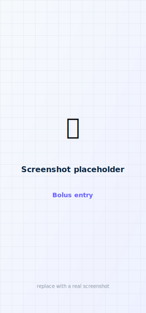
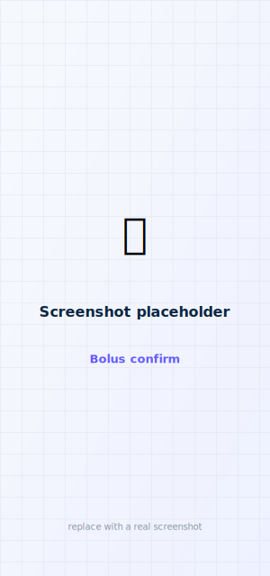
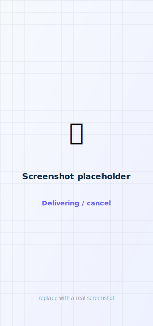

# Bolus & cancel

!!! warning "Confirm every bolus"
    faBolus is experimental and not FDA-cleared. Always confirm the amount before you deliver.

<figure class="cx2-shot phone" markdown="span">
  
  <figcaption>Enter units, or carbs + BG for a recommendation</figcaption>
</figure>
<figure class="cx2-shot phone" markdown="span">
  
  <figcaption>Explicit confirm before anything is delivered</figcaption>
</figure>
<figure class="cx2-shot phone" markdown="span">
  
  <figcaption>Cancel any time while it's delivering</figcaption>
</figure>

## Deliver a bolus

<ol class="cx2-steps">
<li>Open the <strong>Bolus</strong> tab (enabled only when connected). It opens in your default mode (Carbs or Units) from <a href="../customize/settings/">Settings</a>.</li>
<li>Either enter <strong>units</strong> directly, or enter <strong>carbs</strong> (and optionally <strong>BG</strong>) — the recommendation updates <strong>automatically as you type</strong>, using the pump's own calculator (carb ratio, ISF, target, IOB) to suggest a dose. (There's no separate button to press; tapping anywhere on the carbs/units row focuses the field.)</li>
<li>Adjust units with the stepper (step = your <strong>unit increment</strong> from Settings). The <strong>max-units clamp</strong> blocks anything over your pump's configured ceiling.</li>
<li>Tap <strong>Bolus N U</strong>, then confirm the dialog.</li>
</ol>

!!! note "Carbs are recorded on the pump"
    When you deliver a **carb** bolus, faBolus sends the carb amount (and BG, if entered) to the pump
    as part of the bolus, so the carbs show up on the **pump graph / t:connect** and feed Control-IQ's
    carb awareness. The delivered **units are still computed by faBolus** — the pump can't calculate a
    dose from carbs, so faBolus mirrors its calculator (carb ratio, ISF, target, IOB) and the carbs
    ride along as recorded metadata.

## Carb boluses from a remote (single calculator + safety guard)

When you enter **carbs** on the Apple Watch, Garmin, Mac, or a remote iPhone, the **host phone is the
single calculator**: it recomputes the dose from your carbs using its live settings and delivers that.
The remote also sends the estimate it showed you, and the phone **compares** the two — if they differ
by more than **0.10 U** (a sign the remote was working from stale settings, IOB, or glucose) the bolus
is **not delivered**; the remote shows "Dose changed since your estimate — reopen and confirm," and you
retry with fresh data. Units-mode entries are delivered exactly as confirmed.

## Cancel & partial delivery

While a bolus is delivering, a prominent **Cancel** button is available on the HUD and the bolus
sheet. Tapping it sends a cancel to the pump, and the app reports the **actual amount delivered**
before the stop — so a cancelled bolus tells you exactly how much went through.

## From a remote

An Apple Watch or Garmin can *request* a bolus, but the phone stays in control — it is the single
calculator and the only device that talks to the pump:

- **Apple Watch / Garmin:** you complete a hold-to-deliver confirmation **on the wrist** (tap 1-2-3 on
  a touchscreen, or the two-button hold on a button device). The phone then **recomputes the dose from
  the carbs**, checks it against the estimate the wrist showed (a divergence beyond a small tolerance is
  rejected, not delivered), and carries it out. There is *not* a second confirm tap on the iPhone for a
  watch/Garmin request.
- **Parent remote (another iPhone):** a bolus a parent requests for a child's pump *does* raise an
  explicit **approval dialog on the child's phone** showing the frozen dose, carbs, BG, and IOB before
  anything is delivered.
- If the phone is unreachable, the remote shows a clean failure and **nothing is delivered**.

See [Apple Watch](../remotes/apple-watch.md) and [Garmin](../remotes/garmin.md).

## Under the hood (for the curious)

??? info "The signed delivery sequence"
    Via PumpX2Kit: `BolusPermissionRequest` → *(carb bolus only)* best-effort `RemoteCarbEntryRequest`
    + `RemoteBgEntryRequest` to record the carbs/BG on the pump → `InitiateBolusRequest` (signed and
    insulin-delivery-gated; also carries `bolusCarbs`/`bolusBG` inline) → status polling until the bolus
    finishes or is cancelled → `LastBolusStatus` for the delivered amount. The carb/BG records are
    best-effort — a rejected record never blocks the bolus. Every outgoing message is asserted
    byte-exact against the pumpX2 `cliparser` oracle.

## Recommendation reasoning

Under the recommended dose there's a collapsible **Show reasoning** breakdown: the **carb + correction**
total and the **active insulin (IOB)** subtracted. Hide the whole breakdown with **Settings → Bolus &
entry → Show recommendation reasoning**. (The enforced pump-max limit still caps the dose — see the
max-units clamp above.)

## Extended (combo) bolus

Turn on **Settings → Bolus & entry → Extended (combo) bolus** to split a dose into a **now** portion
and a portion delivered **over a duration** (e.g. 50% now, the rest over 2 hours). The total must be at
least 0.40 U. It goes through the same confirm + max-bolus clamp + signed path as a standard bolus.
