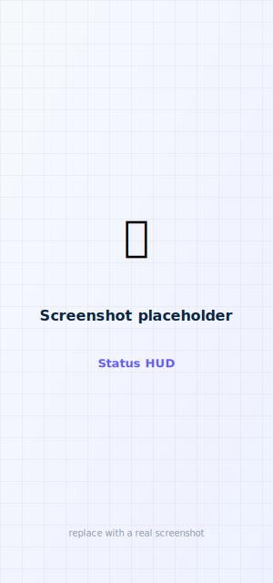

# Dashboard & status

The app is organized into four tabs — **Dashboard · Bolus · Alerts · Settings**. The
**Dashboard** is a modern heads-up display; all values update live while you're connected,
and it scrolls to a details card with everything the pump reports.

<figure class="cx2-shot phone" markdown="span">
  
  <figcaption>Chart, status ring, and pills at a glance</figcaption>
</figure>

## What's on screen

| Element | Shows |
| --- | --- |
| **Glucose chart** | Recent CGM readings from the pump, with an in-range band (70–180 mg/dL) and range-colored points. Pick the window (3 / 6 / 12 / 24 h), and optionally overlay **IOB** and **bolus bars** — see [Settings](../customize/settings.md#dashboard-chart). |
| **Status ring** | Current glucose + trend, ringed by a color for **connection/activity** (connected, delivering, scanning, disconnected). It is **not** a closed-loop indicator — faBolus never automates dosing. |
| **Active Insulin (IOB)** | Insulin on board. |
| **Reservoir** | Units remaining in the cartridge. |
| **Pump** | Battery %. |
| **CGM** | Sensor status. |
| **Last bolus** | Amount and time of the most recent bolus. |
| **Details card** | Scroll down for carb ratio, correction factor (ISF), target, max bolus, reservoir, battery, CGM status, last bolus, and pump time. |

## Connecting

Tap **Connect** (top-left) to scan for and connect to your pump. If a pairing is already saved,
you'll get **Connect (saved pairing)** and **Re-pair with new code** options. The app also
auto-reconnects when you open it or bring it to the foreground. See
[Pairing](../setup/pairing.md).

## Staleness

Every glucose reading shows its **age**. A reading older than **6 minutes** is treated as stale so
it's never mistaken for a current one: on the HUD and the watches it is still shown but **greyed,
with its age called out**; the widgets and Siri report it as not-current. If you set up an optional
[CGM failover](cgm-failover.md) source, an independent reading fills in when the pump's glucose goes
stale.

!!! note "Terminology"
    "Active Insulin" (IOB) means insulin on board. faBolus is a manual remote-bolus + status
    viewer, not an automated closed-loop system.

## Next

- [Deliver a bolus](bolus.md)
- [View and clear alerts](alerts.md)
- [Customize what you see](../customize/settings.md)
