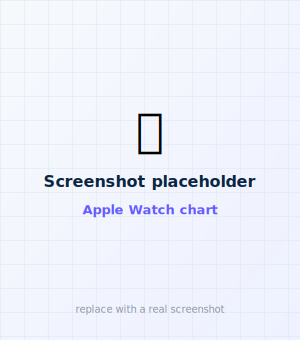
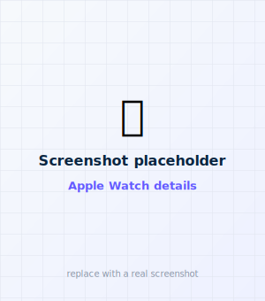
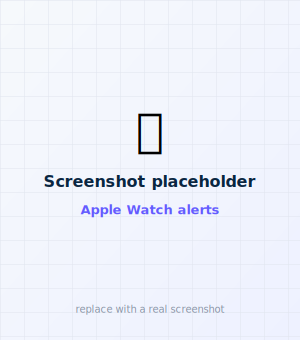
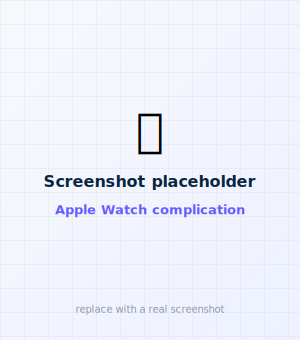

# Apple Watch remote

A modern remote at parity with the phone and Garmin. **The watch never touches the pump** —
PumpX2Kit runs on the iPhone, and the watch relays commands over WatchConnectivity. To install
it, see [Add the Apple Watch app](../build/apple-watch-build.md).

<figure class="cx2-shot watch" markdown="span">
  
  <figcaption>Glance</figcaption>
</figure>
<figure class="cx2-shot watch" markdown="span">
  
  <figcaption>Chart</figcaption>
</figure>
<figure class="cx2-shot watch" markdown="span">
  
  <figcaption>Details</figcaption>
</figure>
<figure class="cx2-shot watch" markdown="span">
  
  <figcaption>Alerts</figcaption>
</figure>

## The screens (swipe between pages)

- **Glance** — big glucose + trend (hidden when stale), IOB, reservoir, alert count, iPhone
  reachability, and the **Bolus** button.
- **Chart** — a modern glucose history plot (the recent readings the phone sends).
- **Details** — active insulin, reservoir, battery, CGM, last bolus, carb ratio, correction
  factor, target, max bolus, connection (matches the phone's details card).
- **Alerts** — active pump alerts/alarms, each with **Clear** (relayed to the phone's signed
  dismiss). Notes when a CGM alert is condition-based.

## Bolus

<figure class="cx2-shot watch" markdown="span">
  
  <figcaption>Dial the amount with the Digital Crown</figcaption>
</figure>

- Tap **Bolus**, pick **Carbs** or **Units** (default from Settings), set the amount with the
  **Digital Crown** (step = the *Watch & Garmin* increment from Settings), then **Bolus**.
- Confirm on the watch (a deliberate confirmation). The iPhone then delivers
  **directly** through the validated signed path — like the Garmin remote — converting carbs to
  units with the pump's calculator. You can **Cancel** while it's delivering.
- If the iPhone is out of range, the request is queued/failed cleanly — never silently delivered.

The watch honors its own bolus/carb increments and default mode, set in
**iPhone → Settings → Watch & Garmin increments** and **Default mode**.

## Watch-face complication

<figure class="cx2-shot watch" markdown="span">
  
  <figcaption>Glucose + trend on the watch face</figcaption>
</figure>

A glucose **complication** (value + trend) is available for the watch face — add it like any
complication (long-press the face → **Edit** → pick a corner → **faBolus** → Glucose). It reads
the last value the watch app published (App Group), hides readings older than 6 minutes, and
refreshes when the watch app updates or on its ~5-min timeline. Supported families: circular,
inline, corner, rectangular.

!!! note "One-time setup (App Group)"
    The complication shares data with the watch app via the App Group
    `group.com.fabolus.app`. It's enabled once on the **faBolusWatch** and
    **faBolusWatchWidgets** targets (Xcode → each target → Signing & Capabilities → App Groups),
    then the watch app + complication install. Automatic signing usually registers it.

## Independent (direct-to-pump) mode

Running the watch **without the iPhone** — pairing the watch straight to the pump — is designed
but **not built**. See the phased plan in [Independent Apple Watch](../design/independent-watch.md).

## The contract

Phone↔watch messages follow [`schema/command.schema.json`](../architecture.md#the-command-contract):
a tiny JSON contract (`kind`, `requestId`, `units`, `confirmToken`, `status`, …). The Swift mirror
is `Shared/RemoteCommand.swift`; transport is `Shared/RemoteLink.swift`. The same contract drives
the [Garmin remote](garmin.md).
