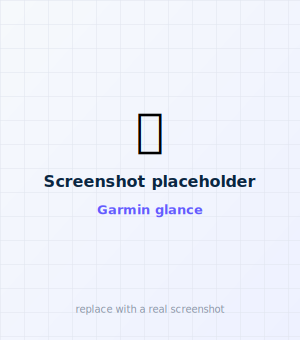
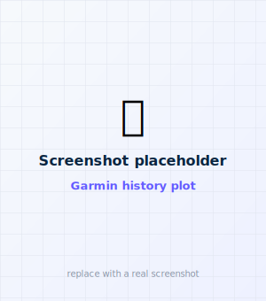
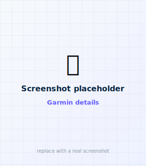
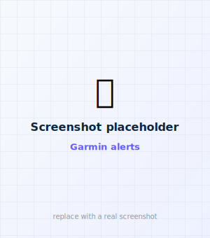
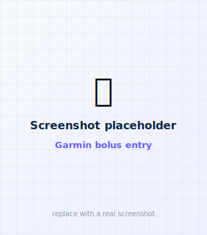
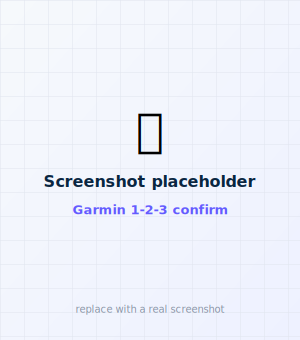
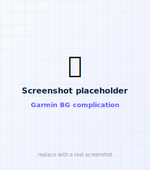

# Garmin remote

A Connect IQ (Monkey C) companion, currently supporting the **Garmin Venu 3S**. It's a **thin
remote**: it messages the iPhone host via the Connect IQ mobile SDK, and the phone runs the confirm
interlock and delivers through PumpX2Kit. To build and install it, see
[Build the Garmin remote](../build/garmin-build.md).

!!! note "The Garmin app lives in its own repo"
    The Garmin app is maintained in the separate
    **[faBolusGarmin](https://github.com/faBolus-app/faBolusGarmin)** repo. The *iPhone side* of the
    bridge is part of the faBolus app, so the two talk over the shared command contract.

!!! note "Which Garmin devices work"
    **Tested:** the Garmin **Venu 3S**. The app also runs on button-only Garmin watches (e.g. the
    fenix and Forerunner lines) and on **Edge cycling computers**, adapting to each device's buttons
    or touchscreen automatically — but those haven't been tested on real hardware yet, so treat them
    as **experimental**.

<figure class="cx2-shot watch" markdown="span">
  
  <figcaption>Glance</figcaption>
</figure>
<figure class="cx2-shot watch" markdown="span">
  
  <figcaption>History plot</figcaption>
</figure>
<figure class="cx2-shot watch" markdown="span">
  
  <figcaption>Details</figcaption>
</figure>
<figure class="cx2-shot watch" markdown="span">
  
  <figcaption>Alerts</figcaption>
</figure>

## The screens (swipe up/down to move between them)

- **Glance** — current glucose + a drawn, range-colored trend arrow, and a **Bolus** button.
- **Alerts** — active pump alerts/alarms; **tap a row to clear** one.
- **History** — a Dexcom-style plot; **tap to cycle** the window **3 → 6 → 12 h**.
- **Details** — last bolus, Active Insulin, reservoir, battery, and an alert count.

### Reorder the screens / pick the default

The **order** of these screens and **which one opens first** are configurable from the phone:
**Settings → Garmin remote → Screen order**. Drag to reorder and choose the screen that opens
first. The layout is sent to the watch on its next status update and is remembered on the watch
(it survives restarts and offline launches). Default: Glance → Alerts → History → Details,
opening on Glance.

## Using it: touch or buttons

faBolus adapts to your device automatically:

- **Touchscreen** (e.g. Venu 3S): **tap** the on-screen buttons (bolus −/+, Deliver, the confirm
  targets, an alert row), and **swipe up/down** to move between screens.
- **Button watches / Edge** (no touchscreen): use the physical buttons — **UP / DOWN** move between
  screens (and set the amount on the bolus screen), **START** selects/delivers, **MENU** switches
  Units/Carbs, **BACK** goes back. No on-screen cursor.

## Bolus flow

<figure class="cx2-shot watch" markdown="span">
  
  <figcaption>Set units or carbs</figcaption>
</figure>
<figure class="cx2-shot watch" markdown="span">
  
  <figcaption>Tap 1 → 2 → 3 to confirm</figcaption>
</figure>

<ol class="cx2-steps">
<li><strong>Set the amount.</strong> <em>Touch:</em> tap the mode chip to switch <strong>Units / Carbs</strong>, tap <strong>−/+</strong> to set the amount, then <strong>Deliver</strong>. <em>Buttons:</em> <strong>UP/DOWN</strong> set the amount, <strong>MENU</strong> switches Units/Carbs, <strong>START</strong> delivers.</li>
<li><strong>Confirm.</strong> <em>Touch:</em> tap <strong>1 → 2 → 3</strong> in order (like unlocking a t:slim) — a wrong tap resets. <em>Buttons:</em> a deliberate two-button hold — <strong>hold UP</strong> to arm, then <strong>hold START</strong> to deliver; let go early to cancel.</li>
<li>Completing the confirm sends the request to the phone, which carries it out. The remote never delivers on its own, and the pump still enforces its max and signature.</li>
</ol>

## BG complication

The app publishes a **public BG complication** (value + a trend arrow, no units) that Garmin
**Face It** faces and Connect IQ faces can show on your watch face. A reading older than 6
minutes shows `--`. It refreshes while the app is open and via a background refresh (~5 min);
fresh data needs the iPhone app open and connected.

!!! warning "Known issue — being fixed"
    The BG complication doesn't update with the live CGM value yet — it currently shows `0` instead
    of the reading. A fix is in progress.

<figure class="cx2-shot watch" markdown="span">
  
  <figcaption>The BG complication on a Face It / CIQ watch face</figcaption>
</figure>

!!! note "Stock Garmin faces can't show it"
    Third-party complication data only appears on **Face It** faces or CIQ faces that support
    complications. Pick one of those and add the *faBolus BG* field.

## Why your iPhone has to be nearby

The Garmin is a remote — it talks to your **iPhone**, which owns the pump connection and confirms
and delivers every bolus. So keep your iPhone with you and connected while you use the Garmin.
Running the pump directly from the Garmin with no phone is a separate future project, not something
the app does today.
