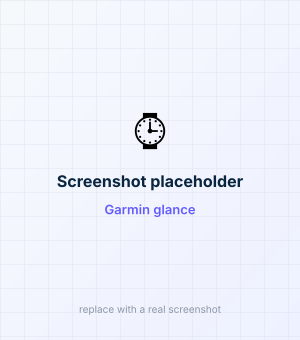
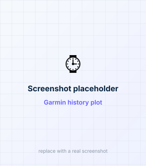
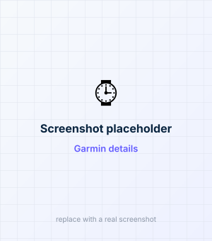
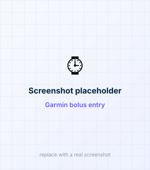
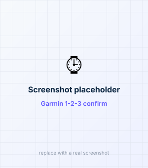
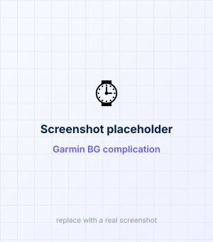

# Garmin remote

A Connect IQ (Monkey C) companion for the **Garmin Venu 3S**. It's a **thin remote**: it messages
the iPhone host via the Connect IQ mobile SDK, and the phone runs the confirm interlock and
delivers through TandemKit. To build and install it, see
[Build the Garmin remote](../build/garmin-build.md).

!!! note "Garmin support is an optional build"
    The iPhone side of the Garmin bridge is compiled in only when the app is built with the Connect
    IQ SDK. If it was built without the SDK, the **Garmin** section under **Settings → Remotes &
    devices** shows a note saying so — rebuild with the Connect IQ SDK to enable it.

!!! note "The Garmin app lives in its own repo"
    The Garmin app is maintained in the separate
    **[faBolusGarmin](https://github.com/faBolus-app/faBolusGarmin)** repo. The *iPhone side* of the
    bridge is part of the faBolus app, so the two talk over the shared command contract.

!!! note "Venu 3S only"
    The Connect IQ manifest builds for the **Venu 3S** alone — it's the one device this app
    supports, and the one it's actually been tested on.

<figure class="cx2-shot watch" markdown="span">
  
  <figcaption>Glance</figcaption>
</figure>
<figure class="cx2-shot watch" markdown="span">
  
  <figcaption>History plot</figcaption>
</figure>
<figure class="cx2-shot watch" markdown="span">
  
  <figcaption>Details</figcaption>
</figure>
<figure class="cx2-shot watch" markdown="span">
  
  <figcaption>Alerts</figcaption>
</figure>

## The screens (swipe up/down to move between them)

- **Glance** — current glucose + a drawn, range-colored trend arrow, and a **Bolus** button.
- **Alerts** — active pump alerts/alarms; **tap a row to clear** one.
- **History** — a CGM history plot; **tap to cycle** the window **3 → 6 → 12 h**.
- **Details** — last bolus, Active Insulin, reservoir, battery, and an alert count.

### Reorder the screens / pick the default

The **order** of these screens and **which one opens first** are configurable from the phone:
**Settings → Garmin remote → Screen order**. Drag to reorder and choose the screen that opens
first. The layout is sent to the watch on its next status update and is remembered on the watch
(it survives restarts and offline launches). Default: Glance → Alerts → History → Details,
opening on Glance.

## Using it

**Tap** the on-screen buttons — bolus −/+, Deliver, the confirm targets, an alert row — and
**swipe up/down** to move between screens.

## Bolus flow

<figure class="cx2-shot watch" markdown="span">
  
  <figcaption>Set units or carbs</figcaption>
</figure>
<figure class="cx2-shot watch" markdown="span">
  
  <figcaption>Tap 1 → 2 → 3 to confirm</figcaption>
</figure>

<ol class="cx2-steps">
<li><strong>Set the amount.</strong> Tap the mode chip to switch <strong>Units / Carbs</strong>, tap <strong>−/+</strong> to set the amount, then <strong>Deliver</strong>.</li>
<li><strong>Confirm.</strong> Tap <strong>1 → 2 → 3</strong> in order (like unlocking a t:slim) — a wrong tap resets.</li>
<li>Completing the confirm sends the request to the phone, which carries it out. The remote never delivers on its own, and the pump still enforces its max and signature.</li>
</ol>

## BG complication

The app publishes a **public BG complication** (a numeric value + a trend arrow) that Garmin
**Face It** faces and Connect IQ faces can show on your watch face; the number is range-colored by the
face. It refreshes while the app is open and via a background refresh (~5 min); fresh data needs the
iPhone app open and connected.

!!! note "Complication staleness"
    A numeric complication can't render `--`, so when a reading goes stale the trend arrow is dropped
    but the last number stays on screen — the complication can lag the CGM (and shows nothing new while
    the phone is unreachable). Use the in-app screens, or the "value + trend" **string** display mode,
    when you need staleness called out. Set the style in **Settings → Remotes & devices**.

<figure class="cx2-shot watch" markdown="span">
  
  <figcaption>The BG complication on a Face It / CIQ watch face</figcaption>
</figure>

!!! note "Stock Garmin faces can't show it"
    Third-party complication data only appears on **Face It** faces or CIQ faces that support
    complications. Pick one of those and add the *faBolus BG* field.

## Why your iPhone has to be nearby

The Garmin is a remote — it talks to your **iPhone**, which owns the pump connection and confirms
and delivers every bolus. So keep your iPhone with you and connected while you use the Garmin.
Running the pump directly from the Garmin with no phone is a separate future project, not something
the app does today.
