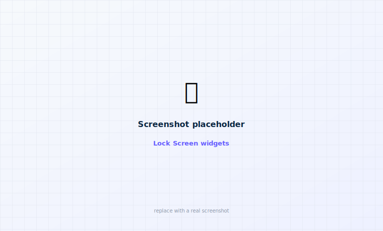
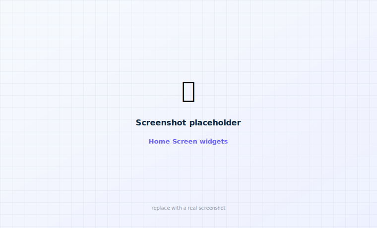
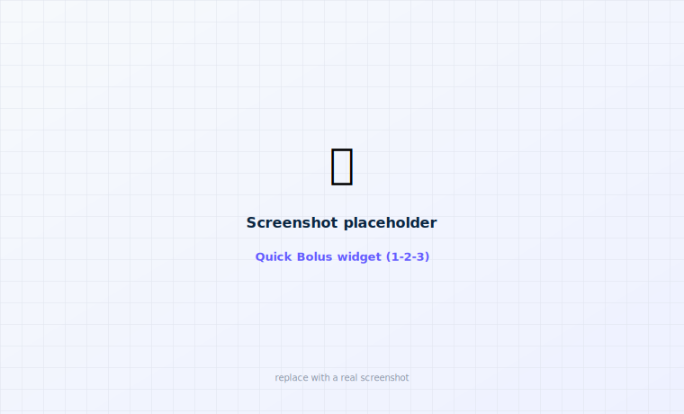

# iPhone widgets

Surface pump data on your Lock Screen and Home Screen. Widgets read the last snapshot the app
publishes to a shared **App Group** — they can't drive Bluetooth themselves, so they show the
last published value and hide any reading older than 6 minutes.

<figure class="cx2-shot wide" markdown="span">
  
  <figcaption>Lock Screen (inline / circular / rectangular)</figcaption>
</figure>
<figure class="cx2-shot wide" markdown="span">
  
  <figcaption>Home Screen (small + medium)</figcaption>
</figure>

## The widgets

| Widget | Where | Shows |
| --- | --- | --- |
| **Glucose** | Lock Screen (inline / circular / rectangular) + Home Screen small | Current glucose + trend arrow, range-colored. |
| **Pump Overview** | Home Screen medium | Glucose trend + a sparkline, Active Insulin, reservoir, last bolus. |
| **Bolus** | Home Screen small + Lock Screen circular | A one-tap shortcut into the bolus entry + confirm flow (`fabolus://bolus`). Opens the app; never dispenses from the widget. |
| **Quick Bolus** | Home Screen small / medium | Delivers a dose **in place** behind a Garmin-style 1-2-3 confirm — see below. |

## Quick Bolus

<figure class="cx2-shot wide" markdown="span">
  
  <figcaption>Set the amount, then confirm 1 → 2 → 3 — delivers without opening the app</figcaption>
</figure>

Quick Bolus mirrors the Garmin flow, right on the Home Screen: tap the **Units / Carbs** label to
switch modes, set the amount with **− / +** (step = your iPhone unit/carb increment; units
clamped to the pump's max, carbs to 200 g), tap **Bolus**, then confirm with a sequential
**1 → 2 → 3** tap (a wrong/late tap within 20 s resets). In carbs mode the app converts to units
with the pump's calculator before delivering. Completing it delivers **in place**: the widget
shows **Delivering… + Cancel**, then **Delivered X.XX U**.

Under the hood the widget hands the confirmed dose to the app over the App Group and a Darwin
notification; the app (kept alive in the background by its `bluetooth-central` connection)
delivers through the validated signed path and writes progress back to the widget. If the pump
isn't connected, the widget shows **"Pump not connected — open app."**

!!! danger "Quick Bolus is a real delivery"
    Completing 1-2-3 delivers the dose (experimental). Unlike the plain **Bolus** widget,
    it is not just a shortcut into the entry screen — treat it like the Garmin hold-to-deliver. It
    only works while the app is running with the pump connected (typically in the background);
    otherwise open the app first.

## Add a widget

<ol class="cx2-steps">
<li>Long-press the Home Screen (or Lock Screen → <strong>Customize</strong>).</li>
<li>Tap <strong>+</strong> / <strong>Add widget</strong> and search for <strong>faBolus</strong>.</li>
<li>Pick a widget and size, and place it.</li>
</ol>

!!! info "On-device setup (once)"
    The **App Group** capability must be enabled on both the app and the widget target — automatic
    signing usually registers it, and the entitlements are generated from `project.yml`. On a
    free Apple account, extensions and App Groups can be finicky; see
    [Troubleshooting](../troubleshoot.md).

!!! note "Freshness"
    Widgets refresh when the app publishes (on every pump update) and on WidgetKit's own schedule.
    If the app hasn't run recently, a widget may show a stale / `--` value with its age.
