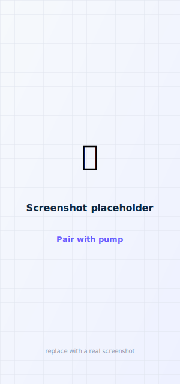

# Pairing your pump

Before the pump accepts any command, it needs an authenticated Bluetooth connection. You do this
once — after that, faBolus reconnects on its own using a securely-stored key, no code needed.

<figure class="cx2-shot phone" markdown="span">
  
  <figcaption>Enter the pump's pairing code, then Connect</figcaption>
</figure>

!!! warning "Unpair the official app first"
    Only **one** control connection can be active at a time. Remove/close the official Tandem
    **t:connect** app's pairing before pairing faBolus, and don't expect them to work at once.

## Pair your pump

Both current pumps use the same secure 6-digit **JPAKE** handshake — what differs is how you put the
pump into pairing mode and where its code comes from. Find your pump below. (faBolus auto-selects the
handshake from the code you enter and the pump's version, so you never have to choose a "scheme.")

### Tandem Mobi

The Mobi has no screen, so its code is a **fixed 6-digit PIN printed behind the cartridge** (next to
the QR code), and you enter pairing mode with the pump's button.

<ol class="cx2-steps">
<li>Get the pump's <strong>6-digit PIN</strong> — it's printed <strong>behind the cartridge</strong>, next to the QR code. (Keep it handy; it doesn't change.)</li>
<li>Following Tandem's procedure, <strong>place the Mobi on its charging pad</strong> to begin, then pick it up and <strong>press the pump button twice</strong> to enter pairing mode.</li>
<li>In faBolus, tap <strong>Connect</strong>, type the <strong>6-digit PIN</strong>, and tap <strong>Connect</strong>. The app scans for the pump, runs the handshake, and derives a signing key.</li>
<li>When the HUD shows <strong>Connected</strong>, you're paired. Live data starts filling in.</li>
</ol>

### t:slim X2 (v7.7+)

The t:slim X2 has a screen, so it shows a fresh 6-digit code when you start pairing on the pump.

<ol class="cx2-steps">
<li>On the pump: <strong>Options → Device Settings → Bluetooth Settings → Pair Device</strong>. The pump screen shows a <strong>6-digit</strong> code.</li>
<li>In faBolus, tap <strong>Connect</strong> and type those 6 digits.</li>
<li>Tap <strong>Connect</strong>. The app scans for the pump, runs the handshake, and derives a signing key.</li>
<li>When the HUD shows <strong>Connected</strong>, you're paired. Live data starts filling in.</li>
</ol>

### Older t:slim X2 (pre-v7.7 — 16-character)

<ol class="cx2-steps">
<li>On the pump: <strong>Options → Device Settings → Bluetooth Settings → Pair Device</strong> to show the <strong>16-character</strong> code.</li>
<li>Enter it in faBolus and connect. The app performs the legacy challenge/response handshake.</li>
</ol>

**Success looks like:** the top of the app says **Connected**, and your glucose, insulin, and
battery start filling in within a few seconds.

!!! note "Switching a Mobi between apps is hands-on"
    Because the Mobi needs the charging pad and physical button presses to enter pairing mode,
    re-pairing it (e.g. switching between faBolus and the official app) is a deliberate, hands-on
    step every time — even less of a quick toggle than the t:slim X2. See
    [Using faBolus alongside the official t:connect app](#using-fabolus-alongside-the-official-tconnect-app).

## After pairing

- The pairing is saved **securely in the iOS Keychain**, so future connects use
  **Connect (saved pairing)** — no code required, even after you rebuild the app.
- If you ever reset the pump or it forgets the app, use **Re-pair with new code** from the
  Connect menu to start fresh.
- The signing key authorizes every insulin-affecting command (bolus permission / initiate /
  cancel). The app tracks the pump's clock so those commands are signed with correct timing.

!!! tip "Nothing connecting?"
    Make sure the pump is in pairing mode, Bluetooth permission is granted to faBolus, and the
    official app isn't holding the connection. More in [Troubleshooting](../troubleshoot.md).

## Using faBolus alongside the official t:connect app

The pump keeps **one** paired controller and issues a **new code** every time you pair — it never
stores two, and the code can't be shared between apps (each derives its own key). So faBolus and the
official **t:connect** app can both be installed, but only one is paired/connected at a time, and
switching is a **full re-pair, not a quick toggle**:

<ol class="cx2-steps">
<li>On the pump, <strong>Pair Device</strong> shows a new code; pair whichever app you want to use.</li>
<li>That <strong>evicts</strong> the other app's pairing — to switch back, you re-pair it with another new code.</li>
</ol>

Day-to-day this is painless if you pick one everyday controller: while faBolus stays paired it
reconnects with **no code**, so the new-code step only appears when you bounce between the two.

!!! note "faBolus doesn't replace the official app"
    Some pump settings and configuration — and certain **Mobi** functions — can only be changed in
    **t:connect**; faBolus doesn't support them yet. When you need one, pair t:connect, make the
    change, then re-pair faBolus for monitoring and remote bolus.

## Under the hood (for the curious)

??? info "What the handshake actually does"
    - **6-digit:** an **EC-JPAKE** handshake (secp256r1 / SHA-256, via mbedTLS in PumpX2Kit) —
      rounds 1–2 plus derive, then Tandem's session-key / key-confirmation rounds 3–4. The
      derived key is `authKey = HKDF(serverNonce, derivedSecret)`, which signs subsequent
      commands.
    - **16-character:** the app sends `CentralChallengeRequest`, receives the pump's HMAC key,
      and replies with a `PumpChallengeRequest` carrying `HMAC-SHA1(pairingCode, hmacKey)`.
